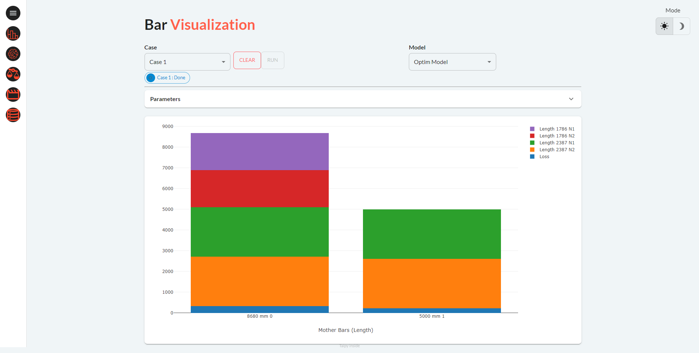
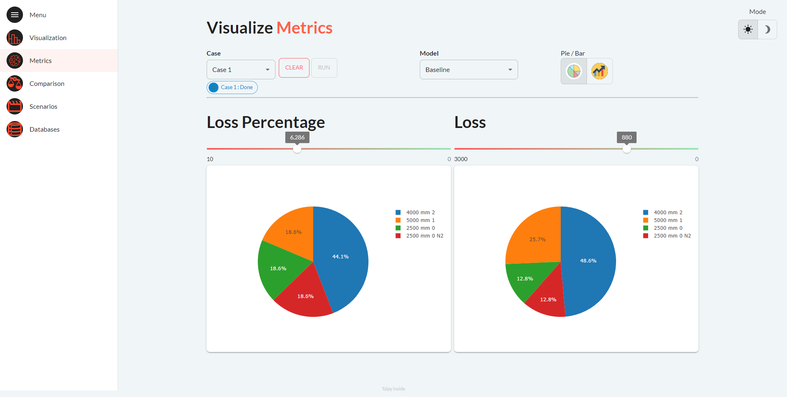
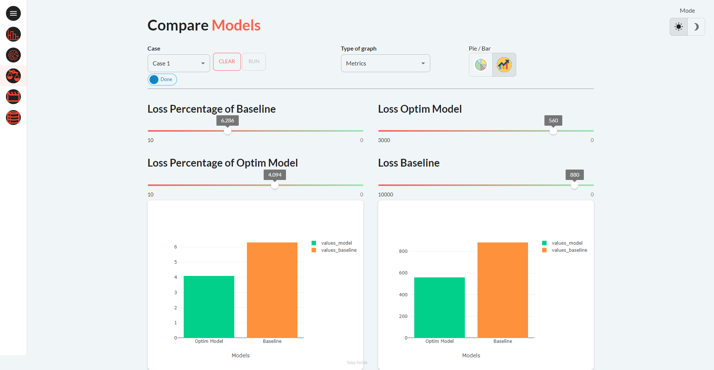
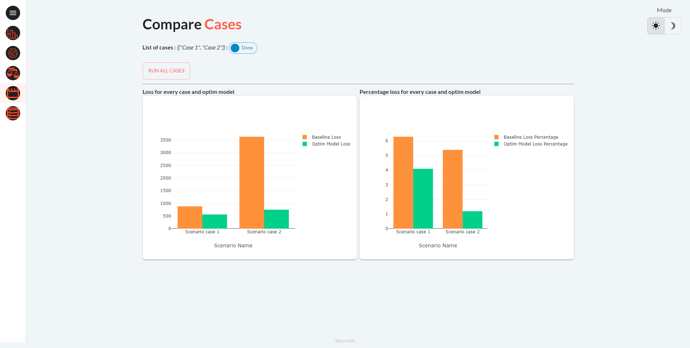
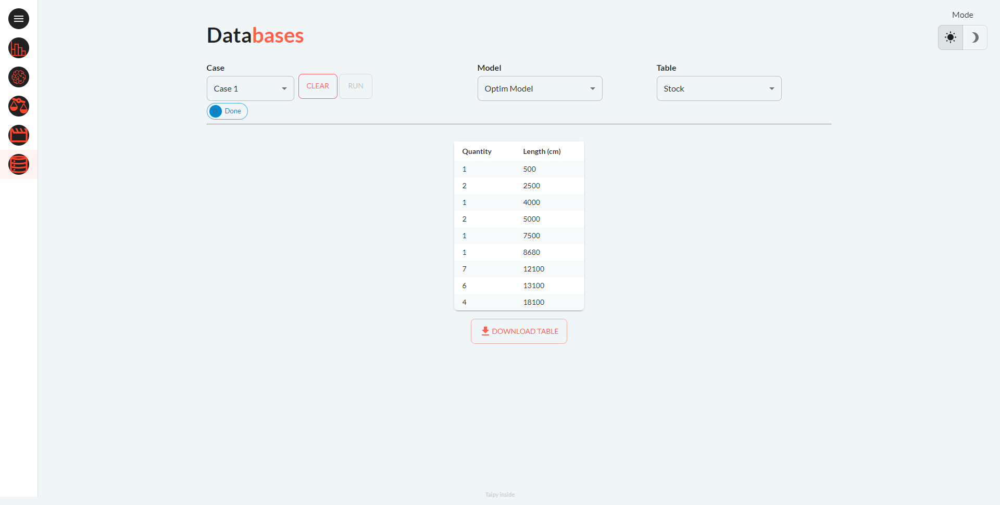

This demo showcases how to optimize the bar-cutting process
to minimize waste. Bar-cutting optimization minimizes waste
by choosing optimal cutting patterns. This is crucial in industries
with significant material costs such as Steel, Timber, etc.

[Try it live](https://bar-cutting.taipy.cloud/Databases){: .tp-btn target='blank' }

# Understand the Application
The application comprises five pages accessible via the left panel.
To visualize them expand the menu list by just clicking inside this left panel

## Page 1: Bar Visualization

1. Load the selected dataset by choosing from two cases ("Case 1" or "Case 2").
2. Select one algorithm (amongst the two algorithms proposed): the "Baseline" or the "Optim Model".
3. Click on "RUN"
4. Within seconds, the results get displayed, highlighting material loss in blue on a bar chart.
5. Switch algorithms to compare material waste.

{width=80%}

To access additional information, you can open the Parameters panel
(Taipy Expandable) to review the input data related to the selected
case, Stock available and Demand to fulfill.

## Page 2: Visual Metrics
On this page, you'll find metrics for both the Baseline Model and
the Optim Model presented in two distinct formats: bar charts and pie
charts. These metrics provide insights into the loss, which can be
visualized as either a percentage of the total length of the mother
bars utilized or as the precise loss value measured in millimeters.

{width=80%}

## Page 3: Compare Models
Compare Baseline and Optim models' performance side by side.

{width=80%}

## Page 4: Compare Cases
Assess the performance of each model across various scenarios.
This represents one of Taipy's most valuable features.

{width=80%}

## Page 5: Databases
Results are neatly summarized in a table, allowing you to select the case,
model and table. The results are then accessible for download in CSV format.

{width=80%}

# Disclaimer
Code for this demo is not publicly available yet. Contact us for a sample.
