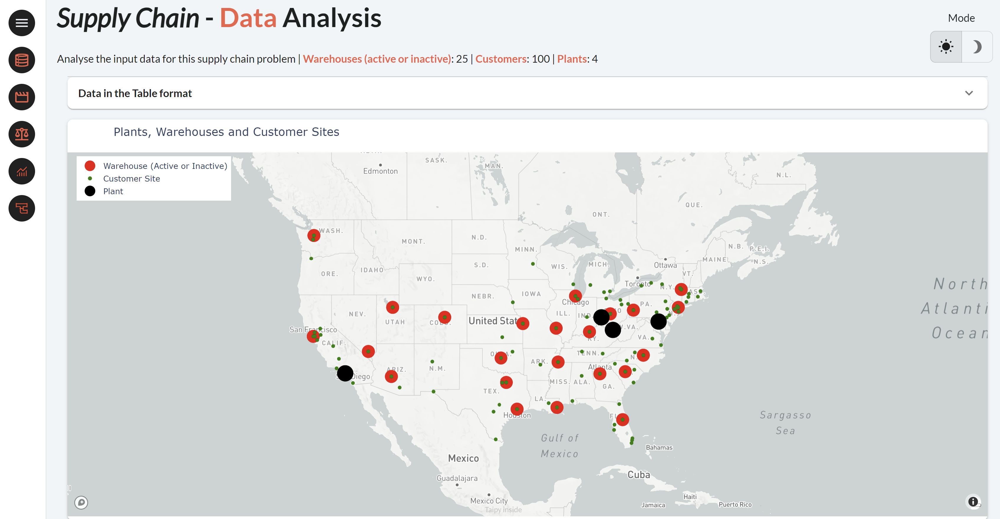
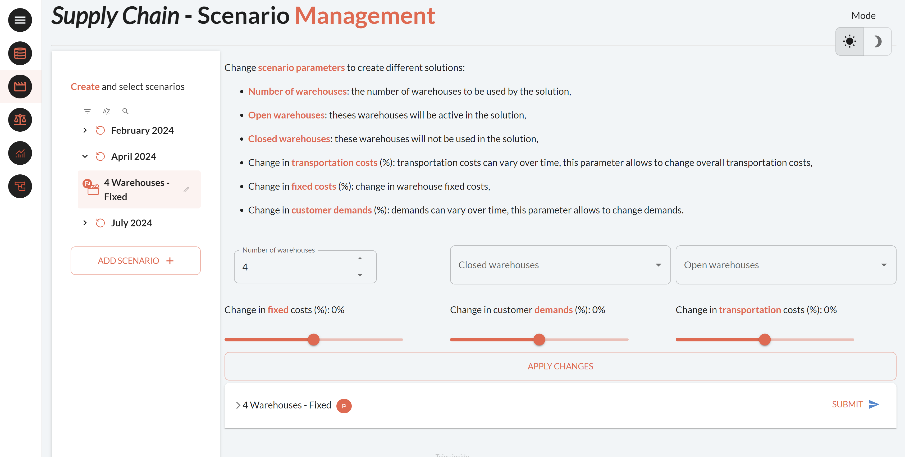

This application demonstrates a comprehensive use case for optimizing multi-echelon 
supply chains, which include plants and multi-products, warehouses, and customer 
distribution. It is particularly suited for manufacturers or distribution companies 
interested in minimizing their transportation costs and overall costs and optimizing 
their entire supply chain network.

This application can be easily tailored to suit various supply chain configurations and 
constraints, including changes in demand, fixed costs, and transportation costs.

!!! note "Taipy Enterprise edition"

    Taipy provides robust, business-focused applications tailored for enterprise
    environments. To maintain standards of security and customization, these
    applications are proprietary like this application. If you're looking for solutions
    that are immediately deployable and customizable to your business needs, we invite
    you to try them out and contact us for more detailed information.

    [Try it live](https://supply-chain-3.taipy.cloud){: .tp-btn target='blank' }
    [Contact us](https://taipy.io/book-a-call){: .tp-btn .tp-btn--accent target='blank' }

{width=90% : .tp-image-border }

# Understanding the Application

In this application, you can navigate to explore the input data and the optimal solutions 
generated.

## Data page

The first screen is the 'Data' page. Here, you can view all the input data for the supply 
chain problem, including a list of 25 potential warehouses, production plants, four 
products, and 100 customers and their related information. You can also view a map 
showing the locations of potential warehouse sites, production plants, and all customer 
locations.

{width=90% : .tp-image-border }

## Scenario Management

This page allows you to create and modify scenarios. You can adjust parameters such as:

- The number of warehouses and production plants to be used.
- Select specific warehouses to be used or avoided in the solution.
- Adjust demand, fixed costs, and transportation costs as input percentages.
- After setting the parameters, you can submit the scenario to launch the optimization 
engine and get the optimal solution.

{width=90% : .tp-image-border }

The results include a solution map showing the selected warehouses, production plants, 
customer locations, and routes used to service each customer. Additionally, you can view 
metrics such as total carbon footprint, total cost, and average cost per unit shipped. 
Charts displaying the volume of demand handled by each warehouse and plant and the number 
of clients assigned to them are also available.

{width=90% : .tp-image-border }

{width=90% : .tp-image-border }

## Comparison

This page lets you compare two scenarios by displaying their solution maps and metrics 
side by side.

{width=90% : .tp-image-border }

## Global Comparison

Here, you can compare all or selected scenarios using charts representing various 
metrics, providing a comprehensive overview of the optimization results.

{width=90% : .tp-image-border }

## Admin page

The Admin page allows you to visualize all the data nodes, executed jobs, and scenarios 
within the application, giving you complete control over managing and monitoring your 
supply chain optimization processes.

{width=90% : .tp-image-border }
