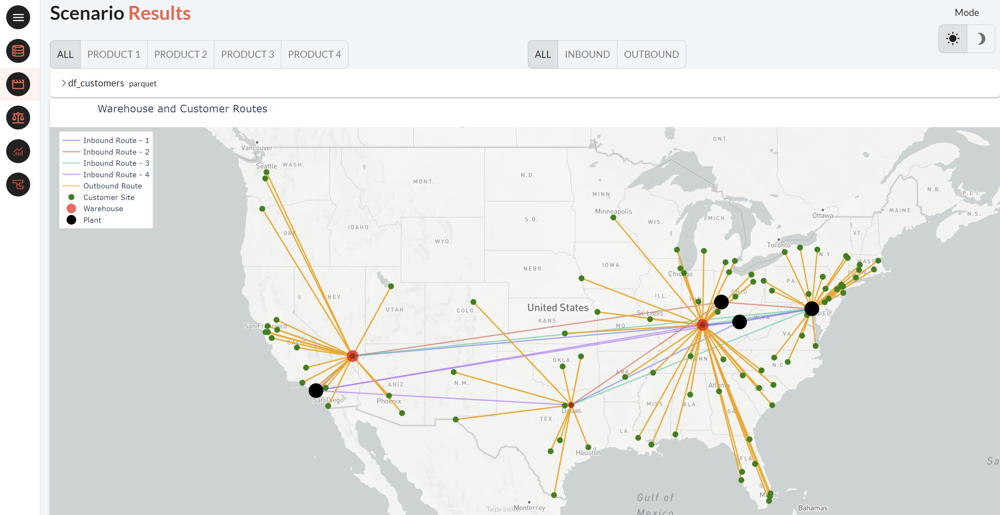
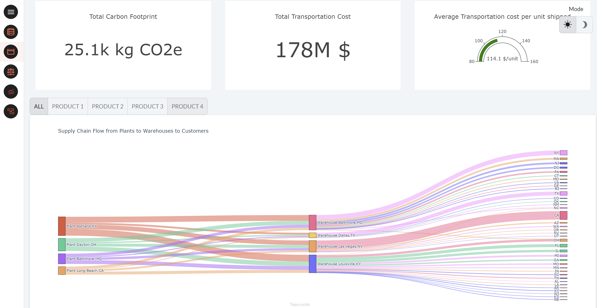

This application is an extension of the 
[2-Echelon application](../3_supply_chain/index.md). It demonstrates a more comprehensive 
use case for optimizing multi-echelon supply chains. Here the supply chain network 
includes the following:

- 4 plants, 
- 25 potential warehouse sites,
- 100 different customer locations, 
- 4 different products are considered. 

Each plant can only produce a single product (this can easily be modified). Each customer 
demands one or more products. Warehouses can handle all products.

The objective is to decide on the best warehouse location to minimize the overall costs 
consisting of:

- Transportation costs (from plant to warehouse, from warehouse to customer locations).
- Warehouse costs (variable and fixed) costs.

This application can be easily tailored to suit various supply chain configurations and 
constraints, including changes in demand, fixed costs, and transportation costs.

!!! note "Taipy Enterprise edition"

    Taipy provides robust, business-focused applications tailored for enterprise
    environments. To maintain standards of security and customization, these
    applications are proprietary like this application. If you're looking for solutions
    that are immediately deployable and customizable to your business needs, we invite
    you to try them out and contact us for more detailed information.

    [Try it live](https://supply-chain-3.taipy.cloud){: .tp-btn target='blank' }
    [Contact us](https://taipy.io/book-a-call){: .tp-btn .tp-btn--accent target='blank' }

{width=90% : .tp-image-border }

# Understanding the Application

In this application, you can:

- Navigate to explore the input data.
- Execute various scenarios and visualize/analyze the optimal solutions generated.
- Compare your scenarios to evaluate the best option.

## Data page

This first page presents the input data using:

- a Table format (open the collapsible Panel "Data in Table Format").
- a map displaying the various site locations.

The input Tables contain:

- The list of all the customer sites (with their associated demand).
- The list of the plants and which products they can produce.
- The list of all the potential sites for the warehouses.

{width=90% : .tp-image-border }

## Scenario Management

This page allows you to create and modify scenarios. For each scenario, you can adjust 
parameters such as:

- The number of warehouses to be used. You will have the option to pre-select some 
specific warehouses. Conversely, you will also be able to remove some warehouses as 
possible choices..
- Adjust demand, fixed costs, and transportation costs as input percentages.
- After setting the parameters, you can submit the scenario to launch the optimization 
engine and get the optimal solution.

{width=90% : .tp-image-border }

The results include a solution map showing the selected warehouses and the routes used 
(from plants to warehouses to customers). 

Important KPI  metrics are also displayed:

- total carbon footprint,
- total cost, and
- average cost per unit shipped. 

The chart at the bottom displays the volume of demand handled by each warehouse and plant 
and the number of clients assigned to them.

{width=90% : .tp-image-border }

{width=90% : .tp-image-border }

## Comparison

This page lets you compare two scenarios by displaying their solution maps and metrics 
side by side.

{width=90% : .tp-image-border }

## Global Comparison

Here, you can compare all or selected scenarios using charts representing various 
metrics, providing a comprehensive overview of the optimization results.

{width=90% : .tp-image-border }

## Admin page

The Admin page allows you to visualize all the data nodes, executed jobs, and scenarios 
within the application, giving you complete control over managing and monitoring your 
supply chain optimization processes.

{width=90% : .tp-image-border }
