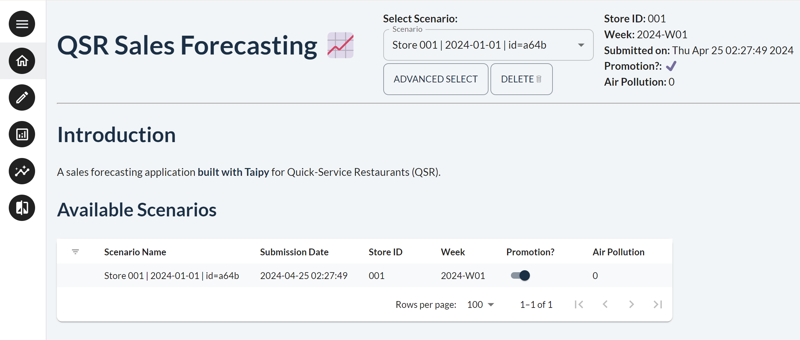
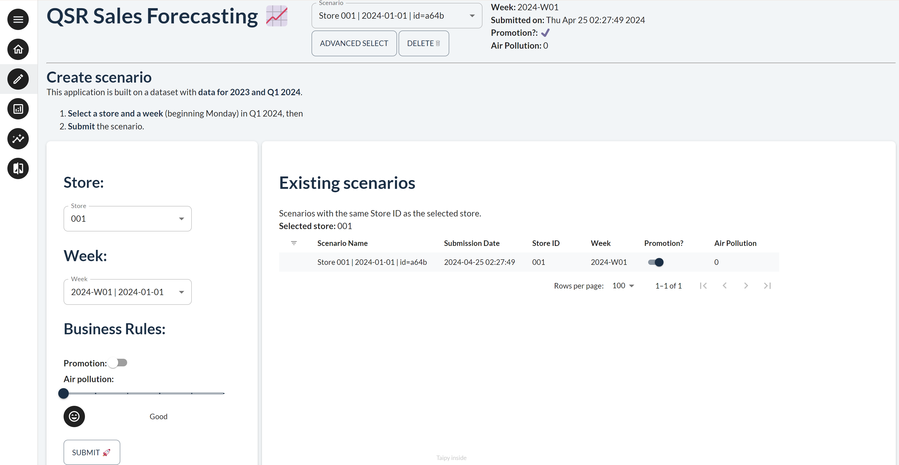
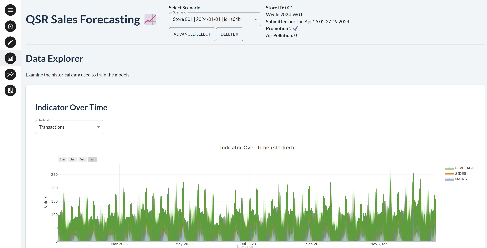
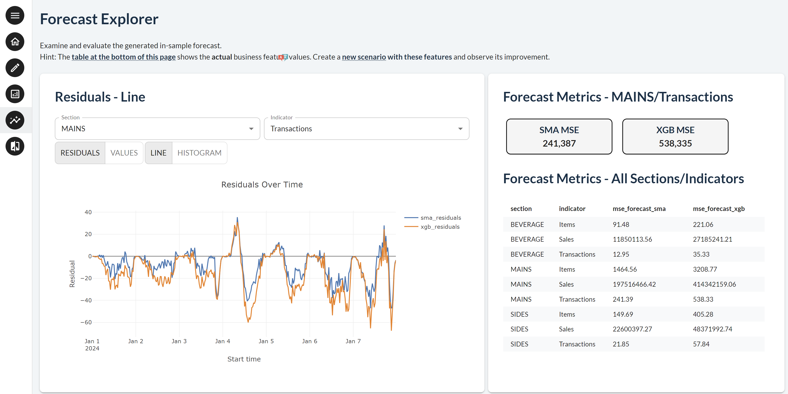
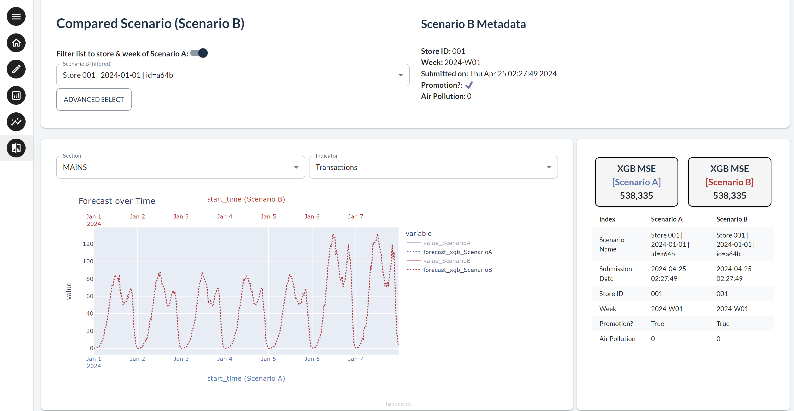

This demo is a scaled-down version of a production application using Taipy, which 
performs sales forecasting for a renowned quick service restaurant (QSR) franchise. This 
business problem involves time series forecasting for several core business activities of 
the QSR, such as sales made on drinks or the number of transactions made at the front 
counter.

!!! note "Enterprise application"

    Taipy provides robust, business-focused applications tailored for enterprise environments. To maintain standards of security and customization, these applications are proprietary like this application. If you’re looking for solutions that are immediately deployable and customizable to your business needs, we invite you to try them out and contact us for more detailed information.

    [Try it live](https://qsr-fcst.taipy.cloud/data){: .tp-btn target='blank' }
    [Contact us](https://taipy.io/book-a-call){: .tp-btn .tp-btn--accent target='blank' }

# Understanding the Application

This application showcases various capabilities of Taipy, including:

1. The use of Taipy Scenario management to handle the forecasting process -- 
encapsulating each forecast execution as a *Scenario*, persisting the parameters 
and results for future reference and evaluation.
2. The use of Taipy GUI to easily create a multi-page application, featuring a navigation 
sidebar and a top panel for selecting a *Scenario*, where both panels are present and 
used on every page.
3. Demonstrates a mini version of a real implemented system that uses Taipy to 
facilitate their sales forecasting.

## Home Page

The landing page which the user is greeted with when the application is launched. The 
dropdown selector on the top panel allows the user to select a scenario to view -- more 
relevant for the later pages. This page also displays a table of already generated 
scenarios.

{width=70% : .tp-image-border }

## Create Page

The page for creating a new scenario. The user can select the scenario parameters, such 
as the store name, forecast start and end dates and other parameters which may be used by 
the forecasting algorithm. After the selections are made, the user can click the "Submit" 
button to *submit* the scenario for execution, during which a progress bar will indicate 
its progress.

{width=90% : .tp-image-border }

## Data and Forecast Page

The page for viewing the forecasts of the selected scenario, which is selected using the 
top panel. Includes a line chart comparing the actual and forecasted sales, and a 
histogram of residuals. The side panel is used to select the *"Section"* and 
*"Indicator"*, which are the business areas that the forecasts are made for.

{width=90% : .tp-image-border }

{width=90% : .tp-image-border }

## Compare Page

The selected scenario is compared against another scenario, which is selected using the 
side panel. Here, the user can view the actual and forecast sales of different stores on 
the same chart.

{width=90% : .tp-image-border }
