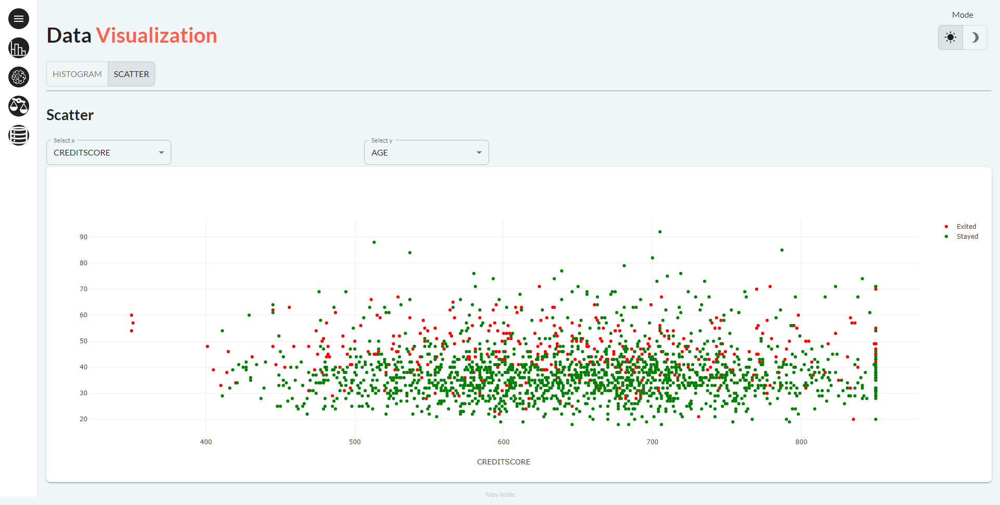
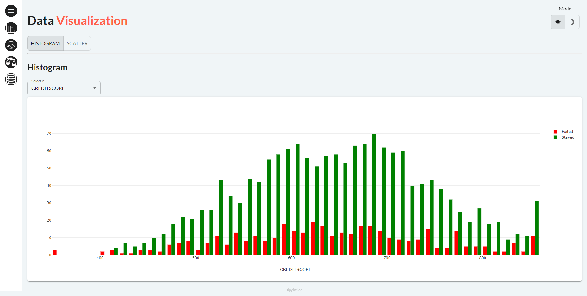
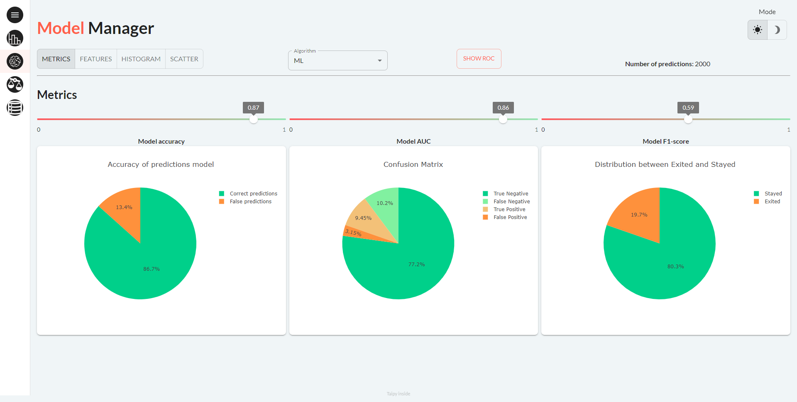
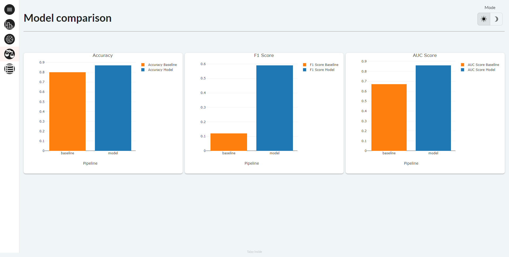

In the fast-paced world of business, retaining customers is a top priority 
because keeping current customers is often more cost-effective than 
acquiring new ones. By identifying customers who may leave early and 
applying retention strategies, businesses can lower churn rates 
and boost customer loyalty.


[Try it live](https://churn-classification.taipy.cloud/Data-Visualization) 

[Get it on GitHub](https://github.com/Avaiga/demo-churn-classification)

# Understanding the Application
The application comprises four pages accessible via the left panel by 
expanding the menu list.

## Page 1: Data Visualization

This page allows to conduct an Exploratory Data Analysis (EDA). You have the option 
to select among two types of graph (scatter plot or histogram) and choose the data 
content you want to explore with the "Select x" button.

{width=80%}

{width=80%}

## Page 2: Model Manager

Here, users can access the performance results of the selected algorithm.
Users can choose an algorithm and chart type to visualize predictions on a validation dataset.

{width=80%}

## Page 3: Model Comparison

This page displays the performance of two models side by side, facilitating easy comparison.

{width=80%}

## Page 4: Databases

Through this page, access to various datasets, including: training dataset, test dataset, forecast, 
scoring results, and the Confusion Matrix of the selected algorithm.
Users can also download specified data frames as CSV files.

{width=80%}  

```$pip install taipy```
