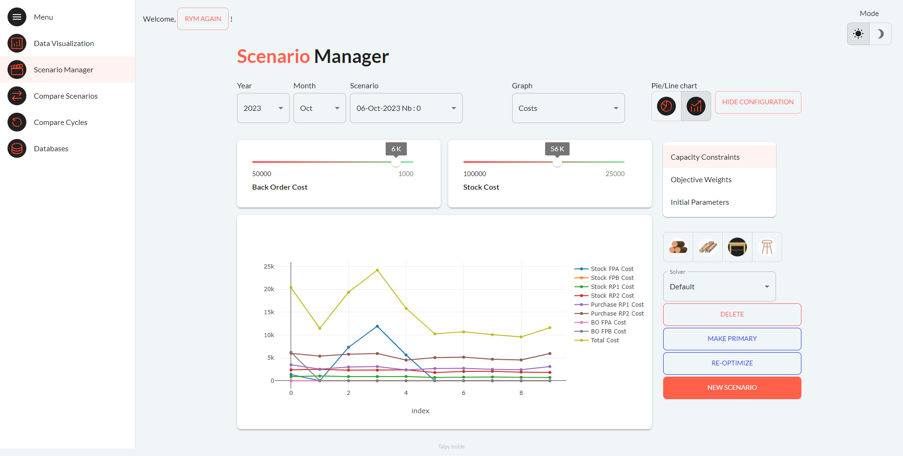
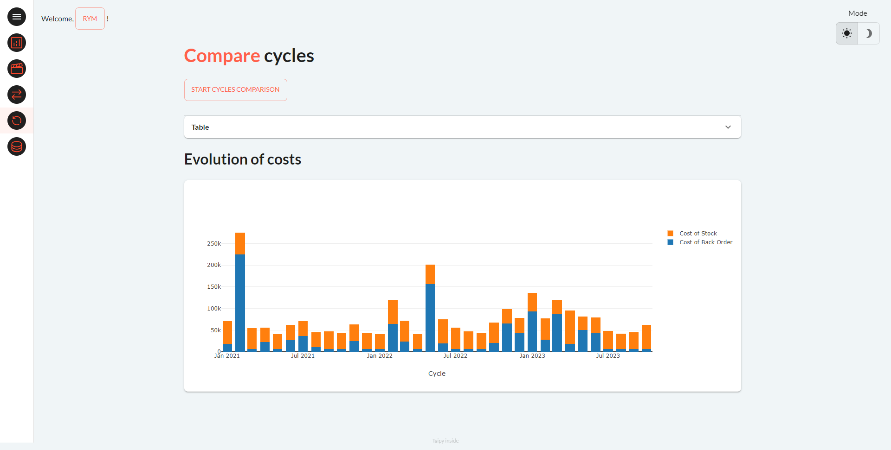

Production planning is pivotal in manufacturing, optimizing resources to meet demand while 
minimizing costs. This demo offers a solution for efficient production and cost management.

[Try it live](https://production-planning.taipy.cloud/Data-Visualization) 

[Get it on GitHub](https://github.com/Avaiga/demo-production-planning)

# Understanding the Application
The application consists of five pages accessible via the left panel 
by expanding the menu list.

The problem revolves around planning production for two finished products: 
FPA (table) & FPB (stool). Each Finished Product is crafted from two raw
products: RPA (oak wood) and RPB (pine planks).

In this demo, an optimization algorithm, based on the PuLP open-source math 
solver, determines the optimal production levels for FPA & FPB, minimizing 
costs while adhering to specific constraints (explained below).

## Page 1: Data Visualization
Upon registering with a new account (name & password), the first page is displayed.

The primary chart depicts future demand for finished products A (FPA) and B (FPB) 
over the next 11 months, with the current month marked as month 0.

{width=80%}

Just above the chart, by clicking "Expand here," you can access an expandable Taipy front-end 
containing initial production data at time 0 (current month): stock & production levels, 
incoming raw material orders, and demand, all presented in a table.


## Page 2: Scenario Manager

Create, configure, and optimize production scenarios.

This is the main page of the application, where users can create new scenarios, adjust 
scenario parameters (on the 'Scenario Configuration' side of the page), and re-submit 
scenarios for re-optimization based on modified parameters.

Initially, no scenario is available, and the Year/Month corresponds to the current month.

{width=80%}

### Creating your first scenario

When creating a new scenario, two new selectors, "Back Orders Cost" and "Stock Cost," 
appear above the main chart, displaying input data for the scenario.

{width=80%}

An optimization algorithm quickly finds the optimal production levels, respecting capacity
constraints and optimizing costs. Results can be displayed as time series or pie charts, and 
different graphs can be selected by choosing the data to display (costs, productions, etc.).

### Modifying the Parameters
This panel enables you to modify parameters categorized into three sections:

1. **Capacity Constraints:** Modify capacity values for different products (finished and raw).
2. **Objectives Weights:** Emphasize minimizing a specific cost (stock or backordering).
3. **Initial Parameters:** Modify other parameters like Initial Stock and Unit Cost.


## Page 3: Compare Scenarios
Compare two scenarios from the same month using metrics such as costs, 
purchases, and productions.

{width=80%}

## Page 4: Compare Cycles

Compare monthly stock and backorder costs from January 2021 to the present 
month using stacked bar charts.

{width=80%}

## Page 5: Datasources

Access and display various tables associated with a selected scenario. 
Conveniently download data tables in CSV format.

{width=80%}

```$pip install taipy```
