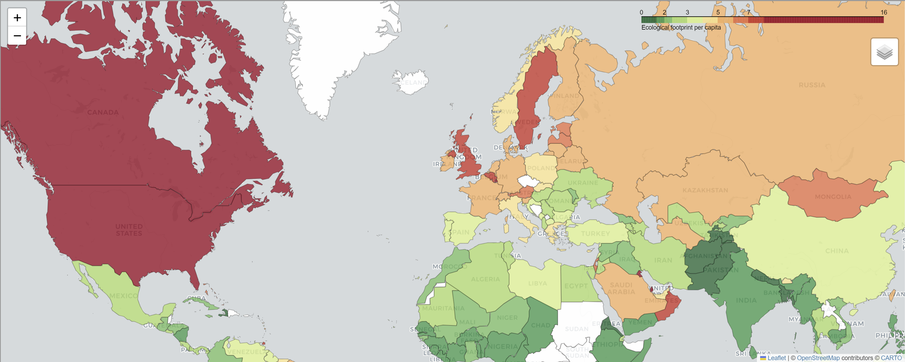

In the world of web development, it's often necessary to integrate third-party components
into your applications. These components could range from interactive visualizations to
videos or other web pages. This article will demonstrate how to effectively include
external resources, focusing on embedding a Folium Map into a web application.

{width=100%}

## Example: Embedding a Folium Map

Let's explore a practical example of integrating a Folium Map into a web
application. Folium is a powerful visualization tool for representing various maps,
finding applications in energy studies, cost analysis, and network analysis.

{width=100%}

In our scenario, we have a Python application that processes recruitment data, performs
analysis, and generates a Folium Map using
[Folium](https://python-visualization.github.io/folium/), a Python library for creating
interactive maps.

Here's a code snippet creating a Folium object:

```python
import folium
import pandas as pd

eco_footprints = pd.read_csv("footprint.csv")
max_eco_footprint = eco_footprints["Ecological footprint"].max()
political_countries_url = (
    "http://geojson.xyz/naturalearth-3.3.0/ne_50m_admin_0_countries.geojson"
)

def folium_map():
    # Create the folium map
    map = folium.Map(location=(30, 10), zoom_start=3, tiles="cartodb positron")
    folium.Choropleth(
        geo_data=political_countries_url,
        data=eco_footprints,
        columns=("Country/region", "Ecological footprint"),
        key_on="feature.properties.name",
        bins=(0, 1, 1.5, 2, 3, 4, 5, 6, 7, 8, max_eco_footprint),
        fill_color="RdYlGn_r",
        fill_opacity=0.8,
        line_opacity=0.3,
        nan_fill_color="white",
        legend_name="Ecological footprint per capita",
        name="Countries by ecological footprint per capita",
    ).add_to(map)
    folium.LayerControl().add_to(map)

    return map
```

[Get the CSV file](./footprint.csv){: .tp-btn target='blank'}


## Integrating the Folium Map

To integrate this *map* object into our web application, we need to create the HTML
version of this object. Here is the code that achieves this:

```python
import tempfile

def expose_folium(map):
    with tempfile.NamedTemporaryFile(delete=False, suffix=".html") as temp_file:
        map.save(temp_file.name)
        with open(temp_file.name, "rb") as f:
            return f.read()
```

In this code, the function *expose_folium()* converts a Folium object (*map*) to HTML, a
mandatory step in integrating any third-party component into your application.

We now proceed to register a function for the object type we want to display. The code below
means that when Taipy encounters a `Map` type in the *content* property, it will use the
*expose_folium* function to convert it to HTML and display it on the page.

```python
from folium.folium import Map

Gui.register_content_provider(Map, expose_folium)
```

Finally, we can embed the Folium Map using the following the `part` component:

```
<|part|content={folium_map()}|>
```

You can adjust the layout by changing its width and height. This element seamlessly
integrates the Folium Map into your web app.

[Get the entire code](./example.py){: .tp-btn target='blank'}

## Conclusion

Incorporating third-party components into your web applications is a powerful technique
to enhance user experience significantly. You can achieve this by converting external
content into HTML and seamlessly integrating it into your web app.

This article demonstrated how to embed a Folium Map using this method. This approach
also ensures that the integrated content doesn't interfere with your page and provides a
secure user experience.

# Entire Code

```python

```

