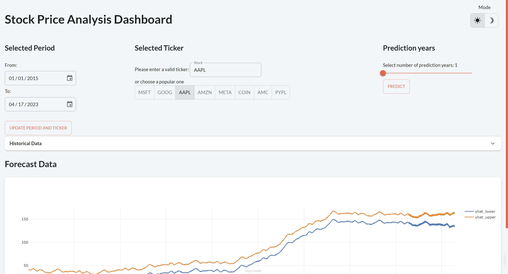
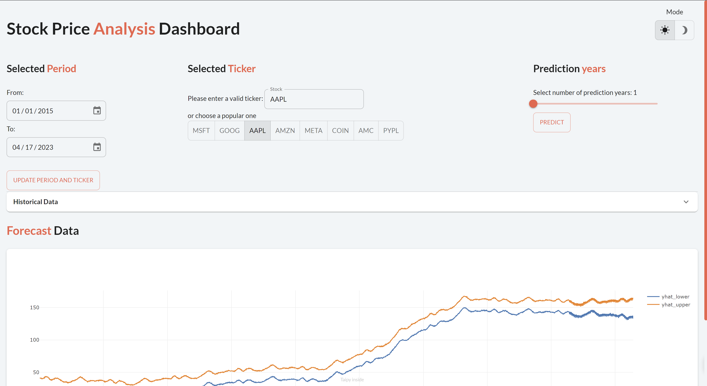

Prepare for a big change in your Taipy applications!
The Stylekit is here and it will make your application look even better.
It comes with pre-made CSS styles, so your application will look great without you having to do much.

But that's not all – you can also make your application look even nicer with some customization.

{width=100%}

The Stylekit has some great features:

- It has ready-made styles for Taipy elements.
- You can change things like color or spacing easily by modifying CSS variables.
- There are also utility CSS classes to make elements look more appealing.

By default, the Stylekit is turned on, so it affects how your page looks.
If you want to turn it off, you can do so by setting the Stylekit parameter of the `Gui.run()` method to False.

## Main CSS Variables

The Stylekit provides a set of variables that affect the look of your Taipy application pages.
It also offers predefined CSS classes for things like changing text style,
adding space around elements, adjusting how things are displayed,
and making elements more or less see-through.

If these terms sound confusing, don't worry. We've made it simple for you to change how your text looks.
You can easily add color or center it.

Now, let's use it in our application:

```python
&lt;|text-center| Taipy **App**{: .color-primary} |&gt;

or

Taipy **App**{: .color-primary}
{: .text-center}
```

Let’s apply it to our application.

{width=100%}

The Stylekit also offers styled sections like containers, cards, headers, and sidebars.
These can be used to make certain parts of your pages more noticeable or to control their size and position.

For instance, you can use a container to add some space around your Markdown content.

```python
<|container|
...
|>
```

This will create a card to put your Markdown/Visual elements in.

```python
<|card|
...
|>
```

In this example, we put a container around the entire application,
and we've also created a card for the parameters at the top.

{width=100%}

## Creating Your Own Theme!

You can also make changes to the default theme of the Stylekit.
Simply define a group of variables with initial values and then override them
by setting the Stylekit parameter in the `Gui.run()` method using a dictionary.

To sum it up, the Stylekit is a groundbreaking feature for Taipy applications,
providing remarkable options for customization and control over how your application looks.
Don't pass up the chance to enhance the appearance of your Taipy application!
