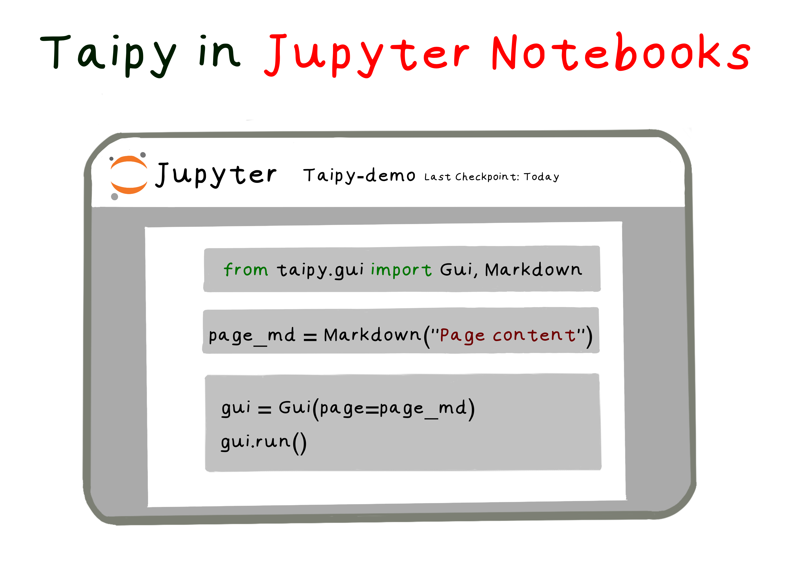
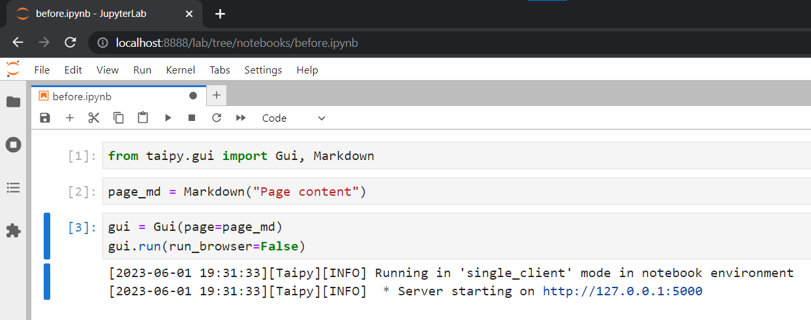

{width=90% : .tp-image }

Taipy's built-in support for Jupyter Notebooks offers us:

1. Access to Taipy's complete set of data visualization and interactivity tools within our
notebooks.

2. A safe environment for trying out Taipy's numerous features and functionalities.

{width=90% : .tp-image-border }

When using Taipy in Python scripts (.py), we typically have to rerun the script whenever we make
changes to our code. In Jupyter Notebook (.ipynb), the equivalent would be to restart the kernel
and rerun all cells, which can be cumbersome.

To solve this and enhance the experience of using Taipy in Jupyter Notebook, we should utilize two straightforward functions for updating the user interface after making changes to our code:

1. [Page.set_content()](../../../manuals/reference/taipy.gui.Page.md#taipy.gui.page.Page.set_content):
   Use this method when you update the content of a page.

2. [Gui.reload()](../../../manuals/reference/taipy.gui.Gui.md#taipy.gui.gui.Gui.reload): Use this
   method when you modify a variable that's used in a page.

# Modifying Page Content

The code below illustrates how to create a basic Taipy web application in a Jupyter Notebook:

{width=90% : .tp-image-border }

When we wish to alter the contents of *page_md*, we might be tempted to (incorrectly) modify and
re-run our existing [page](../../../manuals/reference/taipy.gui.Page.md) definition cell, like this:

{width=90% : .tp-image-border }

However, taking this approach will NOT produce the desired result on our webpage. Instead, we
should utilize the `Page.set_content()^` method, such as `page_md.set_content("New content")`, like
this:

{width=90% : .tp-image-border }

Simply running the new cell (and refreshing the browser) will correctly update our web page.

{width=90% : .tp-image-border }

# Modifying Variable

Another common task is to change the value of a variable used in our Page definition. Consider the
following Jupyter Notebook as an example:

{width=90% : .tp-image-border }

In this example, if we want to change the value of the *title* variable (e.g.,
`title = "Taipy GUI in Jupyter Notebook"``), we need to inform Taipy of the changes by calling
the `Gui.reload()^` method (e.g., `gui.reload()`). 
This ensures that the most recent variable values are loaded from the Jupyter session namespace.
After running the cell, refresh your browser to view the updated changes.

{width=90% : .tp-image-border }

This doesn't only relate to variables on pages, but also to
[callback functions](../../../manuals/gui/callbacks.md) like `on_change` or user-defined callbacks.

# Conclusion

Taipy is dedicated to offering complete web interfaces (GUIs) from both Python scripts and
notebooks. 
To summarize, to effectively use Taipy's GUI in notebooks, remember to do the following:

1. Use `Page.set_content()^` after you make changes to a page's content.

2. Utilize `Gui.reload()^` after you alter a variable that is used on a page.
