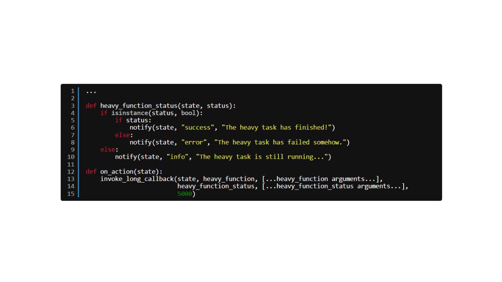

Tasks (server-side functions) in web applications can take a lot of time, which can lead to
problems with communication between the server (Python application) and the client (web browser).

Taipy offers a valuable feature known as "long-running callbacks" to tackle this problem. These
callbacks enable the server to handle resource-intensive processing in the background, ensuring
a responsive user interface.

{width=90% : .tp-image }

This article discusses the concept of long-running callbacks in Taipy, provides usage examples,
and illustrates how they enhance the overall user experience.

# Running Functions in Background

Imagine a situation where a callback starts a duty that requires a lot of resources and time to
finish. To make this work, we can use a straightforward approach:

```python
    from taipy.gui import State, invoke_long_callback, notify

    def heavy_function(...):
        # Do something that takes time...
        ...

    def on_action(state):
        notify(state, "info", "Heavy function started")
        invoke_long_callback(state, heavy_function, [...heavy_function arguments...])
```

In the previous example, the Taipy function `invoke_long_callback()^` manages the
resource-intensive function. It sets up a separate background thread to run `heavy_function()`,
allowing the rest of the application to continue running. The `on_action()` function gets
activated by a user action, like clicking a button.

# Monitoring Function Status

Moreover, you can send notifications to the user's browser or update visual elements depending
on the status of the ongoing process. Taipy offers a way to receive notifications when the
function completes, as shown below:

```python
    def heavy_function_status(state, status):
        if status:
            notify(state, "success", "The heavy function has finished!")
        else:
            notify(state, "error", "The heavy function has failed")

    def on_action(state, id, action):
        invoke_long_callback(state, heavy_function, [...heavy_function arguments...],
                             heavy_function_status)
```

In this example, we introduce the *heavy_function_status()* function, which the
*invoke_long_callback()^* function invokes. When the callback is finished, this function is called.

This allows you to provide the necessary notifications or make updates to the
user interface depending on whether the processing was successful or not.

# Handling Function Result

To update the `State` according to the returned value from *heavy_function()*, you can modify
`heavy_function_status()` as follows:

```python linenums="1"
    def heavy_function_status(state, status, result):
        if status:
            notify(state, "success", "The heavy function has finished!")
            # Actualize the State with the function result
            state.result = result
        else:
            notify(state, "error", "The heavy function has failed")
```

We added a parameter called *result*, which represents the return value of *heavy_function()*.
When *heavy_function()* completes successfully (*status* is True), we update the `State` with
the result by assigning it to a state variable (cf. line 5). This allows you to access the
result in other parts of your application or display it to the user as needed.

Make sure that the `heavy_function()` returns a value. For example:

```python
    def heavy_function(...):
        ...
        return result
```

When you update the State with the result of *heavy_function()*, you ensure that the user
interface shows the result of the resource-intensive function. This creates a smooth and seamless
user experience.

# Tracking Function Progress

Occasionally, it's useful to give regular updates on the progress of a long-running task.
Taipy's `invoke_long_callback()^` provides a convenient method to accomplish this:

```python linenums="1"
    def heavy_function_status(state, status):
        if isinstance(status, bool):
            if status:
                notify(state, "success", "The heavy function has finished!")
            else:
                notify(state, "error", "The heavy function has failed somehow.")
        else:
            notify(state, "info", "The heavy function is still running...")

    def on_action(state):
        invoke_long_callback(state, heavy_function, [...heavy_function arguments...],
                             heavy_function_status, [...heavy_function_status arguments...],
                             5000)
```

In the code above, in line 13, when you include a *period* parameter, the `heavy_function_status()`
function will be regularly activated at the set interval, such as every 5 seconds. This allows
your user interface to show live updates, informing the end user about ongoing work.

# Conclusion

Taipy's long-running callbacks make handling time-consuming tasks in web applications much
easier. By running demanding functions in the background, Taipy ensures that the user interface
responds quickly and avoids potential communication timeouts. With the option to keep an eye on
the function's progress and offer updates, developers can create a smooth user experience, even
when dealing with hefty operations.
