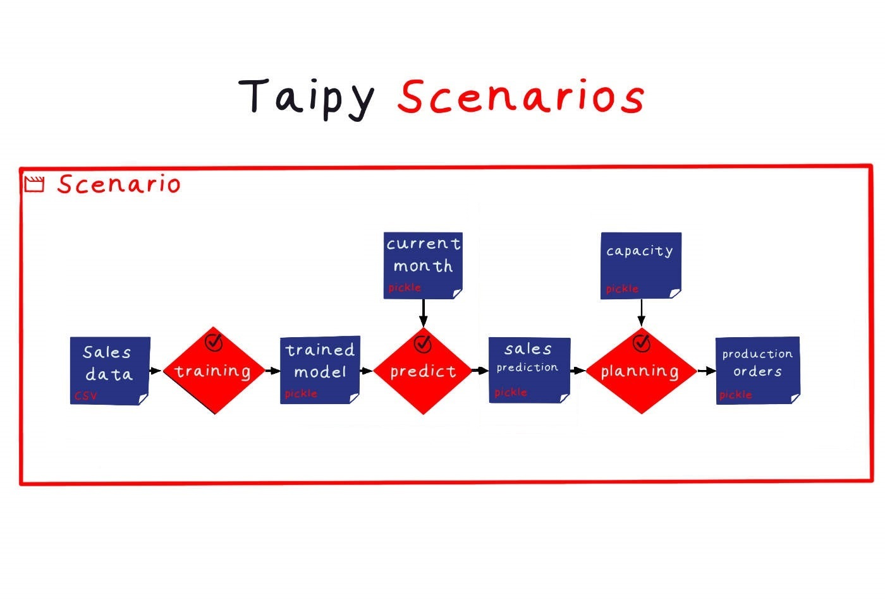

# The Scenarios

In the fast-moving world of business today, people who make decisions need to adapt fast to changes and look at different possibilities to make smart choices. 
Taipy scenarios are a strong tool for running and saving sets of tasks. They can create different versions of a business problem with different guesses. 
This helps users understand the effects and possibilities, which are really important for big decisions.

{width=100%}

In this article, we will examine Taipy scenarios more closely. We will explore what they can do and how they can be useful when making decisions.

As a reminder, Taipy scenarios are one of the fundamental ideas within [Taipy](https://www.taipy.io/about-taipy/what-is-taipy-core/).

## Taipy Scenarios: An Overview

A Taipy scenario is like a test run of a business problem using specific data and settings.

Users can make, save, change, and run different scenarios in one application. This makes it easy to study various versions of a business problem. 
It's really useful for businesses that need to consider many scenarios with different ideas to make the best choice.

## Example: Monthly Production Planning

Imagine a manufacturing company that has to figure out how much to produce each month based on expected sales. The person using the system starts by setting up a plan for January. 
They put in all the data they need and the rules for calculating sales predictions, deciding how much to make, and generating production orders for January.

Next, for February, they make a new plan using updated information for that month. They can keep doing this every month, which helps the company adjust its production plans as things change and new information comes in.

{width=100%}

## Scenarios

Taipy scenarios include one or more sets of tasks that are meant to do specific jobs. These tasks and pipelines can work on their own and can even run at the same time, doing different things.

## Scenario Configuration and Creation

To make a Taipy scenario, users can use the "Config.configure_scenario_from_tasks()" method. They need to set certain things like the scenario's ID, the pipelines it uses, 
how often it runs, what it compares, and its properties. If a scenario only has one pipeline configuration, users can create it directly from that task configuration.

{width=100%}

## Accessing and Managing Scenarios

Taipy offers different ways to work with scenarios. You can do things like getting a scenario by its ID, getting all scenarios, making one scenario the main one, and comparing scenarios.

Users can also add tags to scenarios to keep them organized, and they can save scenarios in JSON format to look at later or share with others.

{width=100%}

The primary benefit of having a scenario is to access the Data Nodes of the different scenarios that are made. With the data generated for each scenario, we can analyze that scenario. 
The basic format is `<scenario>.<Data Node name>.read()`.

## Core visual elements

The [Core visual elements](https://docs.taipy.io/en/latest/manuals/gui/corelements/) allow you to include visual elements in the Taipy backend. This makes it easier than ever to build a web application that matches your backend.

You can add these few lines of code to your script's configuration to create a web application that lets you:

- Choose from the scenarios you've made.
- Create new scenarios.
- Submit them.
- View the configuration used by the scenario.

{width=100%}

## Conclusion

Taipy scenarios are a strong and adaptable tool that businesses can use to investigate different situations with different assumptions. This helps in making smart decisions and analyzing their effects.

By using Taipy scenarios, companies can gain a deeper understanding of what might happen as a result of their choices. This knowledge allows them to make informed decisions that can lead to success in their business.
