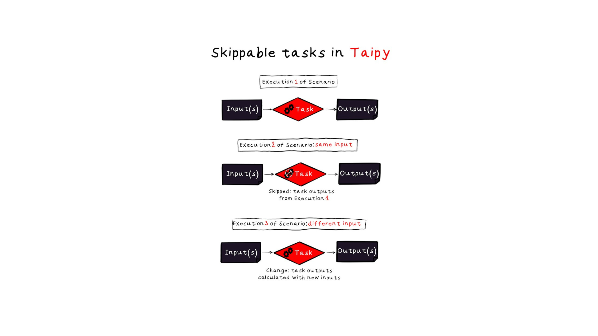
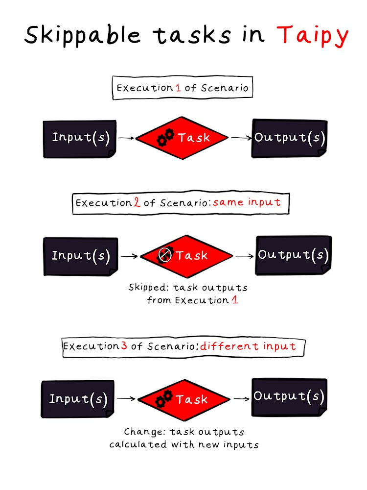

Taipy is a Python library that's user-friendly and made for creating web applications 
with interactive interfaces that handle data. 
This tip is all about Taipy's back-end capabilities. 
Just as a reminder, the main goal of Taipy's back-end is to help you build 
and manage complex workflows, such as data processing pipelines.

{width=100%}

When engineers create Directed Acyclic Graphs (DAGs), they often leave out certain tasks. 
This common practice allows tasks to be orchestrated in a more dynamic and advanced way. 
One of the key features of Taipy's back-end is *skippable* tasks, which can be skipped under specific conditions. 
In this tip, we'll explore how skippable tasks work in Taipy and how to use them effectively.

## Setting up Data Nodes for Tasks

A Task in Taipy is a way to represent a Python function that you want to use in the execution graph. 

It contains:

- Input and output Data nodes.
- The Python function that you've defined and want to use.

{width=100%}

Before you start using skippable tasks, it's important to configure your tasks correctly 
with their Data nodes. You can refer to 
documentation for more details on [Data nodes](../../tips/the_data_nodes/index.md).

For instance, let's say you have a function like *multiply_and_add()* that takes two parameters 
and returns two values. How can you represent this function as a Taipy Task?

```py
def multiply_and_add(nb1, nb2):
    return nb1 + nb2, nb1 * nb2
```

In the animation below:

- The first tab corresponds to the creation of the configuration graphically using Taipy Studio.
- The second tab corresponds to the creation of the very same configuration programmatically.

The order in which you supply Data nodes to the Task is critical. 
Taipy calls the function using the parameters in the same order as the Data nodes, 
and the results are returned in that exact order.

<video width="640" height="360" controls>
  <source src="setting_up_nodes_for_tasks.mp4" type="video/mp4">
  Your browser does not support the video tag.
</video>

```py
from taipy.config import Config
model_cfg = Config.configure_data_node("model", default_path="model.p")
predictions_cfg = Config.configure_data_node("predictions")
task_cfg = Config.configure_task("task", predict, model_cfg, predictions_cfg)
scenario_cfg = Config.configure_scenario("scenario", [task_cfg])
```

In this example, the *multiply_and_add()* function takes two parameters (*nb1* and *nb2*). 
It returns two values: the product and the sum. 
We create configurations for the input Data nodes (*nb_1_cfg* and *nb_2_cfg* in this order) 
and the output Data nodes (*sum_cfg* and *product_cfg*).

Finally, we configure the Task with the appropriate input and output Data nodes.

## Leveraging Skippability in Taipy Tasks

Skippability is an optional setting that you can enable when configuring a Task.

When you set skippable to True, Taipy will skip executing the Task 
if its input Data nodes have not changed since the last execution. 
In other words, if running the task again would produce the same output, it is skipped.

This feature can significantly improve the performance of your data workflow 
by preventing unnecessary computations, which saves time and resources.

{width=70%}

## Use Case

Let’s take the previous execution graph and set *skippable=True* to our Task.

<video width="640" height="360" controls>
  <source src="use_case.mp4" type="video/mp4">
  Your browser does not support the video tag.
</video>

```py
...
task_cfg = Config.configure_task("multiply_and_add",
                                  function=multiply_and_add,
                                  input=[nb_1_cfg, nb_2_cfg],
                                  output=[sum_cfg, product_cfg], skippable=True)
...
```

With the code below, we create and submit an instance of this scenario configuration.

```py
scenario = tp.create_scenario(scenario_cfg)
tp.submit(scenario)
print("Results (sum):", scenario.sum.read())
```

```py
[...] [Taipy] [INFO]   job   JOB_multiply_and_add_...   is
completed.
Results (sum): 23
```

The task associated with my Task has been completed, which means that my function has been executed.

The line below is resubmitting the scenario, but please note that I haven't made 
any changes to my input Data nodes in any way.

```py
tp.submit(scenario)
print(&amp;amp;amp;quot;Results (sum):&amp;amp;amp;quot;,scenario.sum.read())
```

As expected, Taipy is skipping the Task because the input parameters haven't changed. 
If there are multiple tasks in this scenario, Taipy may skip several of them.

The code below shows what happens when we submit the scenario after making a change to an input Data node. 
In this case, the value of *nb_1* is updated from 21 to 42.

```py
scenario.nb_1.write(42)
tp.submit(scenario)
print("Results (sum):", scenario.sum.read())
```

```py
[...] [Taipy] [INFO]   job   JOB_multiply_and_add_...   is
completed.
Results (sum): 44
```

The input changed, so Taipy will re-execute my Task and give the appropriate results (44).

## Using Global Data Nodes

Skipping tasks doesn't only happen when you resubmit a scenario; 
it can also occur when creating and submitting a completely new scenario with Global Data nodes.

For instance, if you want to preprocess a raw data set and make the result accessible globally 
across the entire application, you can change the scope of both Data nodes (the raw data set and the result) to Global. 
This means that all scenarios will share these Data nodes, and the Task related to this operation might be 
skipped across different scenarios.

Let's revisit our previous code and modify the Data nodes to have a Global scope.

<video width="640" height="360" controls>
  <source src="using_global_data_nodes.mp4" type="video/mp4">
  Your browser does not support the video tag.
</video>

```py
from taipy.config import Config
model_cfg = Config.configure_data_node("model", default_path="model.p")
predictions_cfg = Config.configure_data_node("predictions")
task_cfg = Config.configure_task("task", predict, model_cfg, predictions_cfg)
scenario_cfg = Config.configure_scenario("scenario", [task_cfg])
```

The first line creates a scenario consisting of Data nodes, and tasks. 
Following this, we submit it.

```py
scenario_1 = tp.create_scenario(scenario_cfg)
tp.submit(scenario_1)
print("Results (sum):", scenario_1.sum.read())
```

```py
[...] [Taipy] [INFO]   job   JOB_task_multiply_and_add_...   is
completed.
```

```py
Results (sum): 23
```

The only task has been completed, and the results have been computed.

Now, let's create another scenario. 
This new scenario won't create new Global Data nodes (both input and output). 
Instead, it will reuse the ones that were created by *scenario_1*.

```py
scenario_2 = tp.create_scenario(scenario_cfg)
tp.submit(scenario_2)
print("Results (sum):", scenario_2.sum.read())
```

```py
[...] [Taipy] [INFO]   job   JOB_task_multiply_and_add_...   is
skipped.
Results (sum): 23
```

Taipy skips the Task if the input Data nodes have not changed and reuses the existing output's Data.

## Manual Changes

Taipy uses the last modification date of a Data Node to determine if an input Data node has been changed. 
This modification date can be altered in three ways:

- When you submit a Task or a scenario, it automatically updates the last modification date.
- You can manually update it by writing: `DataNode.write()`.
- Taipy also monitors the last modification date of the file that your Data Node refers to. 
  If you (or a separate process) modify a file (e.g., CSV, JSON, etc.) that the Data Node is linked to, 
  Taipy detects this change and adjusts the skippable logic accordingly.

## Conclusion

In conclusion, Taipy simplifies the management of complex workflows and their execution. 
The use of skippable tasks allows developers to enhance efficiency significantly 
by avoiding redundant computations, ultimately saving time and resources for end users. 
Skippable tasks can be applied in various scenarios, including when resubmitting scenarios 
or making manual changes to Data nodes.

By grasping and utilizing skippable tasks effectively in Taipy, developers can create efficient 
and streamlined applications that provide better service to their users.
