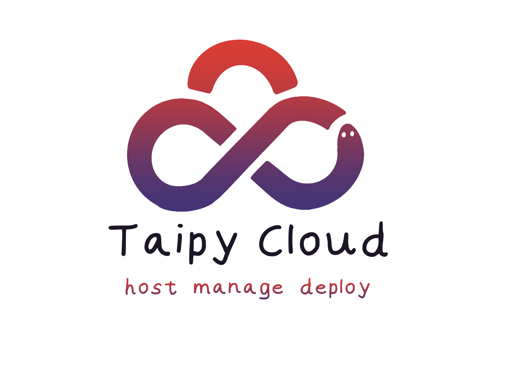
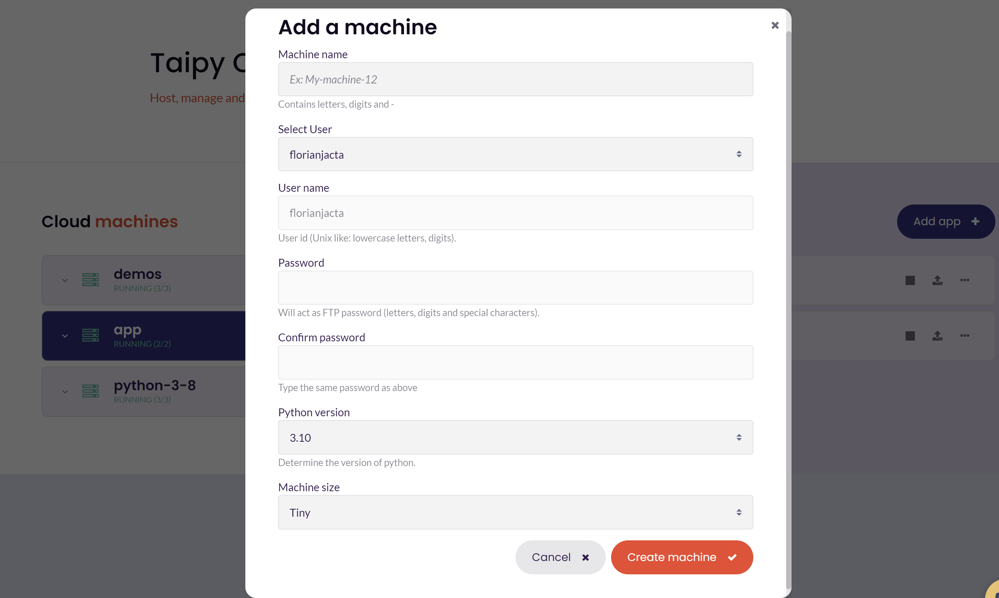

Welcome to Taipy Cloud, the platform designed to make application deployment easier,
ensuring accessibility and stability. In this detailed guide, we will take you through
the process of deploying a Taipy application on Taipy Cloud.

{width=100%}

We'll cover everything from configuration to testing.

## Step 1: Configure Your Application

To deploy your application, you need to prepare a `requirements.txt` file
that lists all the dependencies necessary for your Taipy application.

Here are the steps to create this file:

1. In your project directory, create a new file named `requirements.txt`.
2. List all the dependencies, one per line, as shown in the example below
3. Create a zip archive containing your project folder, including your application’s `requirements.txt` and `main.py` files.

```py
taipy
scikit-learn
statsmodels
pandas
```

## Step 2: Create an Account on Taipy Cloud

Visit [taipy.io/cloud/](https://www.taipy.io/cloud/) and sign up for an account or sign in with your account if it already exists.
This will enable you to deploy applications with ease.

## Step 3: Create a Machine

Before deploying your first application, you need to create a machine on Taipy Cloud.
Machines can be tailored to meet your specific needs, and when you click **Add machine**
on the Taipy Cloud dashboard, you can configure several parameters:

- **Machine name**: Provide a unique name for your machine.
- **Python version**: Choose from a Python version 3.8, 3.9, 3.10, 3.11, or 3.12.
- **Machine size**: Select from Small, Medium, or Large, depending on your application's requirements.
  Larger machines can handle more complex applications simultaneously. The default setting is a small-size machine.
  If you're a first-time user of Taipy Cloud, you'll also be prompted to create a username and password.
  This will allow you to access your machine's logs.

These configurations enable you to customize your machine according to your application's
needs and access important information about its performance.

{width=100%}

## Step 4: Create an Application

After creating your app, you can select it and see the applications on it.
For now, there is none; let’s make one.

Click **Add App** and upload your Taipy Application’s zip file.
Specify the names of your main script and `requirements.txt` file.

{width=100%}

Additionally, you can choose a custom name for your application and URL,
which will be displayed as `<Deployment name>.taipy.cloud`.

## Step 5: Test Your App

Once your Taipy application is deployed, you can test it to ensure everything is functioning correctly.
To do this, access it using the provided URL and run through its features, verifying its stability and accessibility.

Additionally, you can access the Console Logs link, which displays application events
such as warnings, errors, and print statements, offering insights into your application’s performance.

The Taipy Cloud dashboard provides additional information such as CPU, RAM, and Disk usage for each machine and application.

In conclusion, Taipy Cloud is an outstanding platform for deploying your applications with ease.
By following these straightforward steps, you can ensure that your application remains accessible and stable,
ultimately enhancing the overall user experience.
