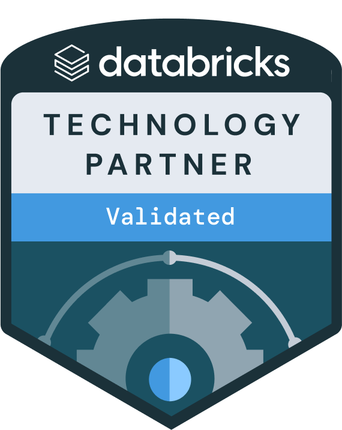
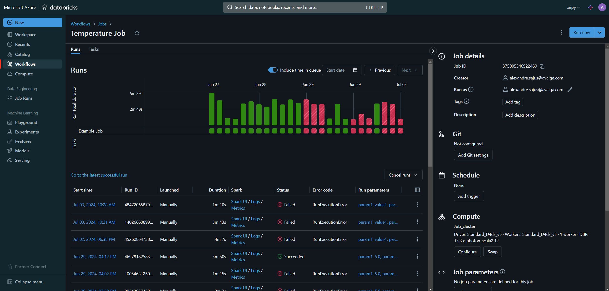

Integrating a Taipy application with Databricks allows you to quickly build a
web application on top of your Databricks notebooks. You can easily put your
algorithms and models into end-users hands.

{width=20% : .tp-image}

!!! note "Available in Taipy Enterprise edition"

    This documentation uses components that are only available in Taipy Enterprise.

    <iframe width="560" height="315" class="tp-video" src="https://www.youtube.com/embed/4mYHbORZpHk?si=b47uLOcFHr5ASyz_" title="Databricks integration" frameborder="0" allow="accelerometer; autoplay; clipboard-write; encrypted-media; gyroscope; picture-in-picture; web-share" referrerpolicy="strict-origin-when-cross-origin" allowfullscreen></iframe>


    [Contact us](https://taipy.io/book-a-call){: .tp-btn .tp-btn--accent target='blank' }

This article presents the best practice for integrating Taipy with Databricks:
calling Databricks jobs from a Taipy application. More specifically, this
documentation demonstrates how to integrate Taipy scenarios with Databricks
jobs. Taipy's scenarios serve as a potent tool for orchestrating tasks and
performing 'what-if' analysis (i.e. examining various versions of a business
problem).

{width=80% : .tp-image}

# Scenarios and Databricks Integration

Creating and executing jobs on Databricks involves several steps, from setting up your
Databricks workspace to defining and running jobs. Here's a step-by-step guide on how
to create and run jobs on Databricks, which can be seamlessly integrated with Taipy
scenarios:

**Requirements:**

- A [Databricks Workspace](https://docs.databricks.com/en/admin/workspace/index.html).

**1 - Create a Databricks Notebook**

Jobs are not necessarily Notebooks. For more information about other types of
jobs, refer to the
[Databricks documentation](https://docs.databricks.com/en/workflows/jobs/create-run-jobs.html).

- **Navigate to Workspace:** In Databricks, navigate to the workspace where you want to
  create the notebook.
- **Create a Notebook:** Click on the "Workspace" tab, then select "Create" and choose
  "Notebook."
- **Define Notebook Details:** Enter a name for your notebook, choose the language
  (e.g., Python, Scala, or SQL), and select the cluster you want to use.

**2 - Define Databricks Job Logic**

- **Create the Cluster**: Go to the Compute section to create a cluster with the
  packages required by your code. You would also need to install `dbutils` to
  have widgets/parameters and get the results for your job.
- **Write Code:** In the notebook, write the code that defines the logic of your
  Databricks job. This code can include data processing, analysis, or any other tasks you
  need to perform.

Here is an example of a Databricks Notebook where parameters are passed to the job
and results are then retrieved:

```python
import pandas as pd

# Get the parameter values
param1 = dbutils.widgets.get("param1")
param2 = dbutils.widgets.get("param2")

# Use the parameter values in your code if you like
print("Parameter 1:", param1)
print("Parameter 2:", param2)

def dummy(param1, param2):
    # create your code and logic
    data = pd.read_csv("https://raw.githubusercontent.com/Avaiga/taipy-getting-started-core/develop/src/daily-min-temperatures.csv")

    # Results sent as the output of the job
    result = data[:5]
    return result

result = dummy(param1, param2)

# Results sent as the output of the job
dbutils.notebook.exit(result)
```

`dbutils.widgets.get("param1")`: is how you can get the parameters passed to your job.
Note that results and parameters are stringified. Only JSON-serializable objects can be
passed through this interface.

**3 - Create a Databricks Job**

- **Create the Job:** In Databricks, go to Workflows and click on "Create Job".
- **Configure Job Settings:**

  - **Name** Provide a name for your job.
  - **Existing Cluster:** Choose an existing cluster or create a new one.
  - **Notebook Path:** Specify the path to your notebook.
  - **Job Libraries:** Add any additional libraries required for your job.
- **Advanced Options:** Configure any advanced options based on your
  requirements. Check [Databricks documentation](https://docs.databricks.com/en/workflows/jobs/create-run-jobs.html)
  for more information.

# Databricks Class: Bridging the Gap

To seamlessly integrate Databricks jobs with scenarios, we introduce the `Databricks`
class. This class is to be used within your own Taipy project. It facilitates
communication with Databricks clusters, enabling users to
trigger jobs and retrieve results.

```python
Databricks(
    workspace_url: str,
    bearer_token: str
)
```

The `Databricks` class allows users to trigger jobs, monitor their status, and retrieve
results seamlessly within the Taipy framework. You can now add a
function that runs and retrieves the appropriate results in your project.

```python
from taipy.databricks import Databricks

default_param = {"param1": "value1", "param2": "value2"}

def predict(parameters):
    databricks = Databricks(
        os.environ['DatabricksWorkspaceUrl'],
        os.environ['DatabricksBearerToken'],
    )

    JOB_NAME = "my_job_name"

    return databricks.execute(JOB_NAME, parameters)
```

As you can see, multiple values are used to connect to Databricks and to the right job.

- *DatabricksWorkspaceUrl*: Databricks Workspace URL, which is the base URL of your Databricks
  (example: *xxxyyyyzzz.azuredatabricks.net*).
- *DatabricksBearerToken*: your bearer token. Create one using this
  [tutorial](https://docs.databricks.com/en/dev-tools/auth/pat.html).
- *JOB_NAME*: the name of the job you want to run.

This *predict()* function is usable by Taipy inside a scenario. A potential
integration into the configuration is as follows:

```python
from taipy import Config

params_cfg = Config.configure_data_node("params",
                                        default_data={"param1": "value1",
                                                      "param2": "value2"})

results_cfg = Config.configure_data_node("result")

task_databricks_cfg = Config.configure_task("databricks",
                                            input=[params_cfg],
                                            function=predict,
                                            output=[results_cfg])

scenario_cfg = Config.configure_scenario("scenario", task_configs=[task_databricks_cfg])
```

Now that the scenario is configured, it can be created and executed to retrieve the
proper results.

```python
import taipy as tp

if __name__ == "__main__":
    tp.Orchestrator().run()

    scenario = tp.create_scenario(scenario_cfg)

    scenario.submit()
    print(scenario.result.read())
```

You can now run the Python script. Taipy will create a scenario, submit it, and
retrieve the results from the Databricks job.

In Databricks, you can monitor the job execution in real-time. Databricks
provides logs and detailed information about the job's progress.

{width=80% : .tp-image}

# Databricks + Taipy

In conclusion, integrating Databricks jobs with Taipy scenarios is unlocked by creating a
class for handling Databricks jobs. This class can then be used inside Taipy as a
standard Taipy task. With this capability, you can incorporate any Databricks workflow
within Taipy and benefit from:

- Great scalable  interactive graphics
- Taipy's what-if analysis, supported by its scenario management,
- Support for different end-user profiles, etc.

{width=80% : .tp-image}
