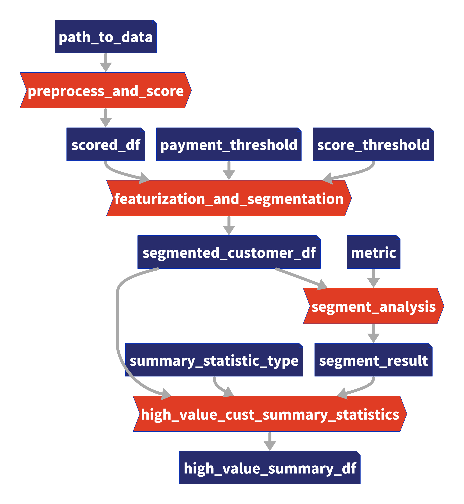
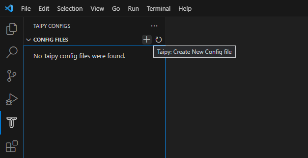
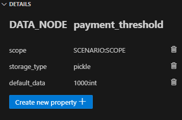
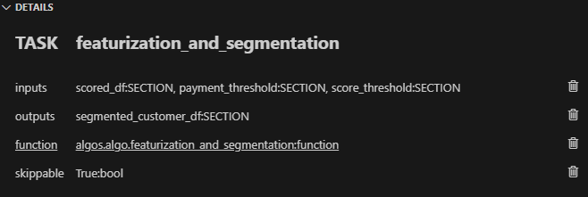
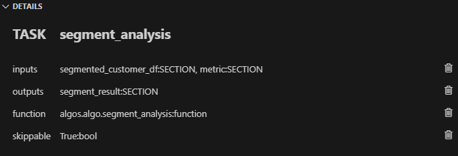
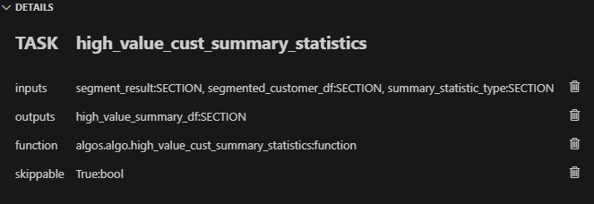

A guide to building models that are bigger than your computer memory.

Data pipelines are the backbone of any data-intensive project. As datasets grow beyond
memory size ("out-of-core"), handling them efficiently becomes challenging. [Dask](https://docs.dask.org/en/stable/)
enables effortless management of large datasets
(out-of-core), offering great compatibility with Numpy and Pandas.

This article focuses on the seamless integration of Dask (for handling out-of-core data)
 with Taipy, a Python library used for pipeline orchestration and scenario management.

# Sample Application

Integrating Dask and Taipy is demonstrated best with an example. In this article, we'll
consider a Taipy data workflow with four tasks:

- Data Preprocessing and Customer Scoring:
Read and process a large dataset using Dask.
- Feature Engineering and Segmentation:
Score customers based on purchase behavior.
- Segment Analysis: Segment customers into categories based on these scores and other factors.
- Summary Statistics for High-Value Customers:
Analyze each customer segment to derive insights


We will explore the code of these four tasks in finer detail. Note that this code is your
Python code and is not using Taipy. In a later section, we will show how you can use
Taipy to model your existing data applications and reap the benefits of its workflow
orchestration with little effort.

<hr/>

The application will comprise of the following five files:

```
algos/
├─ algo.py  # Our existing code with 4 tasks
data/
├─ SMALL_amazon_customers_data.csv  #  A sample dataset
app.ipynb  # Jupyter Notebook for running our sample data application
config.py  # Taipy configuration which models our data workflow
config.toml  # (Optional) Taipy configuration in TOML made using Taipy Studio
```
<hr/>

# Taipy Solution

Taipy is more than just another orchestration tool. Specially designed for ML engineers,
data scientists, and Python developers, Taipy brings several essential and straightforward features.

Here are some key elements that make Taipy a compelling choice:

**A - Pipeline execution registry**

This feature enables developers and end-users to:

- Register each pipeline execution as a "Scenario" (a graph of tasks and data nodes);
- Precisely trace the lineage of each pipeline execution and
- Compare scenarios with ease, monitor KPIs, and provide invaluable insight for troubleshooting
and fine-tuning parameters.

**B - Pipeline versioning**

Taipy's robust scenario management enables you to effortlessly adapt your pipelines to evolving project demands.

**C - Smart task orchestration**

Taipy allows the developer to model the network of tasks and data sources quickly. This
feature provides built-in control over the execution of your tasks with:

- Parallel execution of your tasks; and
- Task "skipping", i.e., choosing which tasks to execute and
which to bypass.


**D - Modular approach to task orchestration**

Modularity isn't just a buzzword with Taipy; it's a core principle. Setting up tasks and
data sources that can be used interchangeably, resulting in a cleaner, more maintainable codebase.

<hr/>

# Introducing Dask

Dask is a popular Python package for distributed computing. The Dask API implements the
familiar Pandas, Numpy, and Scikit-learn APIs — which makes learning and using Dask much
more pleasant for the many data scientists already familiar with these APIs.

If you're new to Dask, check out the excellent
[10-minute Introduction to Dask](https://docs.dask.org/en/stable/10-minutes-to-dask.html)
by the Dask team.

<hr/>

# Application: Customer Analysis

{width=70% : .tp-image}

Our existing code (without Taipy) comprises 4 functions (in orange), which you can also see in the graph above:

- Task 1: *preprocess_and_score()*
- Task 2: *featurization_and_segmentation()*
- Task 3: *segment_analysis()*
- Task 4: *high_value_cust_summary_statistics()*

You can skim through the following *algos/algos.py* script, which defines the 4
functions and then continue reading on for a brief description of what each function does:

```python title="algos/algo.py"

import time

import dask.dataframe as dd
import pandas as pd

def preprocess_and_score(path_to_original_data: str):
    print("__________________________________________________________")
    print("1. TASK 1: DATA PREPROCESSING AND CUSTOMER SCORING ...")
    start_time = time.perf_counter()  # Start the timer

    # Step 1: Read data using Dask
    df = dd.read_csv(path_to_original_data)

    # Step 2: Simplify the customer scoring formula
    df["CUSTOMER_SCORE"] = (
        0.5 * df["TotalPurchaseAmount"] / 1000 + 0.3 * df["NumberOfPurchases"] / 10 + 0.2 * df["AverageReviewScore"]
    )

    # Save all customers to a new CSV file
    scored_df = df[["CUSTOMER_SCORE", "TotalPurchaseAmount", "NumberOfPurchases", "TotalPurchaseTime"]]

    pd_df = scored_df.compute()

    end_time = time.perf_counter()  # Stop the timer
    execution_time = (end_time - start_time) * 1000  # Calculate the time in milliseconds
    print(f"Time of Execution: {execution_time:.4f} ms")

    return pd_df

def featurization_and_segmentation(scored_df, payment_threshold, score_threshold):
    print("__________________________________________________________")
    print("2. TASK 2: FEATURE ENGINEERING AND SEGMENTATION ...")

    # payment_threshold, score_threshold = float(payment_threshold), float(score_threshold)
    start_time = time.perf_counter()  # Start the timer

    df = scored_df

    # Feature: Indicator if customer's total purchase is above the payment threshold
    df["HighSpender"] = (df["TotalPurchaseAmount"] > payment_threshold).astype(int)

    # Feature: Average time between purchases
    df["AverageTimeBetweenPurchases"] = df["TotalPurchaseTime"] / df["NumberOfPurchases"]

    # Additional computationally intensive features
    df["Interaction1"] = df["TotalPurchaseAmount"] * df["NumberOfPurchases"]
    df["Interaction2"] = df["TotalPurchaseTime"] * df["CUSTOMER_SCORE"]
    df["PolynomialFeature"] = df["TotalPurchaseAmount"] ** 2

    # Segment customers based on the score_threshold
    df["ValueSegment"] = ["High Value" if score > score_threshold else "Low Value" for score in df["CUSTOMER_SCORE"]]

    end_time = time.perf_counter()  # Stop the timer
    execution_time = (end_time - start_time) * 1000  # Calculate the time in milliseconds
    print(f"Time of Execution: {execution_time:.4f} ms")

    return df

def segment_analysis(df: pd.DataFrame, metric):
    print("__________________________________________________________")
    print("3. TASK 3: SEGMENT ANALYSIS ...")
    start_time = time.perf_counter()  # Start the timer

    # Detailed analysis for each segment: mean/median of various metrics
    segment_analysis = (
        df.groupby("ValueSegment")
        .agg(
            {
                "CUSTOMER_SCORE": metric,
                "TotalPurchaseAmount": metric,
                "NumberOfPurchases": metric,
                "TotalPurchaseTime": metric,
                "HighSpender": "sum",  # Total number of high spenders in each segment
                "AverageTimeBetweenPurchases": metric,
            }
        )
        .reset_index()
    )

    end_time = time.perf_counter()  # Stop the timer
    execution_time = (end_time - start_time) * 1000  # Calculate the time in milliseconds
    print(f"Time of Execution: {execution_time:.4f} ms")

    return segment_analysis

def high_value_cust_summary_statistics(df: pd.DataFrame, segment_analysis: pd.DataFrame, summary_statistic_type: str):
    print("__________________________________________________________")
    print("4. TASK 4: ADDITIONAL ANALYSIS BASED ON SEGMENT ANALYSIS ...")
    start_time = time.perf_counter()  # Start the timer

    # Filter out the High Value customers
    high_value_customers = df[df["ValueSegment"] == "High Value"]

    # Use summary_statistic_type to calculate different types of summary statistics
    if summary_statistic_type == "mean":
        average_purchase_high_value = high_value_customers["TotalPurchaseAmount"].mean()
    elif summary_statistic_type == "median":
        average_purchase_high_value = high_value_customers["TotalPurchaseAmount"].median()
    elif summary_statistic_type == "max":
        average_purchase_high_value = high_value_customers["TotalPurchaseAmount"].max()
    elif summary_statistic_type == "min":
        average_purchase_high_value = high_value_customers["TotalPurchaseAmount"].min()

    median_score_high_value = high_value_customers["CUSTOMER_SCORE"].median()

    # Fetch the summary statistic for 'TotalPurchaseAmount' for High Value customers from segment_analysis
    segment_statistic_high_value = segment_analysis.loc[
        segment_analysis["ValueSegment"] == "High Value", "TotalPurchaseAmount"
    ].values[0]

    # Create a DataFrame to hold the results
    result_df = pd.DataFrame(
        {
            "SummaryStatisticType": [summary_statistic_type],
            "AveragePurchaseHighValue": [average_purchase_high_value],
            "MedianScoreHighValue": [median_score_high_value],
            "SegmentAnalysisHighValue": [segment_statistic_high_value],
        }
    )

    end_time = time.perf_counter()  # Stop the timer
    execution_time = (end_time - start_time) * 1000  # Calculate the time in milliseconds
    print(f"Time of Execution: {execution_time:.4f} ms")

    return result_df
```

<h3>Task 1 — Data Preprocessing and Customer Scoring (*preprocess_and_score()*)</h3>

This is the first step in your pipeline and perhaps the most crucial. It reads a large
dataset using **Dask**, designed for larger-than-memory computation. It then calculates a
"Customer Score" in a DataFrame named scored_df, based on various metrics like
"*TotalPurchaseAmount*", "*NumberOfPurchases*", and "*AverageReviewScore*".

After reading and processing the dataset with Dask, this task will output a Pandas
DataFrame for further use in the remaining three tasks.

<h3>
Task 2 — Feature Engineering and Segmentation (*featurization_and_segmentation()*)
</h3>

This task takes the scored DataFrame and adds new features, such as high spending indicators It
also segments the customers based on their scores.

<h3>Task 3 — Segment Analysis (*segment_analysis()*)</h3>

This task takes the segmented DataFrame and performs a group-wise analysis based on the
customer segments to calculate various metrics.

<h3>Task 4 — Summary Statistics for Customers (*high_value_cust_summary_statistics()*)</h3>

This task performs an in-depth analysis of the high-value customer segment and returns
summary statistics.

# Modeling the Workflow

{width=100% : .tp-image-border }

<center>
Taipy DAG — Taipy "Tasks" in orange and "Data Nodes" in blue.
</center>

In this section, we will create the Taipy configuration, which models the variables/parameters
(represented as ["Data Nodes"](../../../userman/sdm/data-node/index.md)) and functions
(represented as ["Tasks"](../../../userman/sdm/task/index.md)) in Taipy.

Notice that this configuration in the following `config.py` script is akin to defining
variables and functions — except that we are instead defining "blueprint variables" (Data
Nodes) and "blueprint functions" (Tasks). We are informing Taipy on how to call the
functions we defined earlier, default values of Data Nodes (which we may overwrite at
runtime), and if Tasks may be skipped:

```python title="config.py"
from taipy import Config

from algos.algo import (
    preprocess_and_score,
    featurization_and_segmentation,
    segment_analysis,
    high_value_cust_summary_statistics,
)

# -------------------- Data Nodes --------------------

path_to_data_cfg = Config.configure_data_node(id="path_to_data", default_data="data/customers_data.csv")

scored_df_cfg = Config.configure_data_node(id="scored_df")

payment_threshold_cfg = Config.configure_data_node(id="payment_threshold", default_data=1000)

score_threshold_cfg = Config.configure_data_node(id="score_threshold", default_data=1.5)

segmented_customer_df_cfg = Config.configure_data_node(id="segmented_customer_df")

metric_cfg = Config.configure_data_node(id="metric", default_data="mean")

segment_result_cfg = Config.configure_data_node(id="segment_result")

summary_statistic_type_cfg = Config.configure_data_node(id="summary_statistic_type", default_data="median")

high_value_summary_df_cfg = Config.configure_data_node(id="high_value_summary_df")

# -------------------- Tasks --------------------

preprocess_and_score_task_cfg = Config.configure_task(
    id="preprocess_and_score",
    function=preprocess_and_score,
    skippable=True,
    input=[path_to_data_cfg],
    output=[scored_df_cfg],
)

featurization_and_segmentation_task_cfg = Config.configure_task(
    id="featurization_and_segmentation",
    function=featurization_and_segmentation,
    skippable=True,
    input=[scored_df_cfg, payment_threshold_cfg, score_threshold_cfg],
    output=[segmented_customer_df_cfg],
)

segment_analysis_task_cfg = Config.configure_task(
    id="segment_analysis",
    function=segment_analysis,
    skippable=True,
    input=[segmented_customer_df_cfg, metric_cfg],
    output=[segment_result_cfg],
)

high_value_cust_summary_statistics_task_cfg = Config.configure_task(
    id="high_value_cust_summary_statistics",
    function=high_value_cust_summary_statistics,
    skippable=True,
    input=[segment_result_cfg, segmented_customer_df_cfg, summary_statistic_type_cfg],
    output=[high_value_summary_df_cfg],
)

scenario_cfg = Config.configure_scenario(
    id="scenario_1",
    task_configs=[
        preprocess_and_score_task_cfg,
        featurization_and_segmentation_task_cfg,
        segment_analysis_task_cfg,
        high_value_cust_summary_statistics_task_cfg,
    ],
)
```

You can read more about configuring Scenarios, Tasks, and Data Nodes in the
[documentation here](../../../userman/sdm/scenario/scenario-config.md).


# Scenario Creation and Execution

Executing a Taipy scenario involves:

- Loading the config;
- Running the Taipy Orchestrator service; and
- Creating and submitting the scenario for execution.

Here's the basic code template:

```python
import taipy as tp
from config import scenario_cfg  # Import the Scenario configuration

if __name__ == "__main__":
    tp.Orchestrator().run()  # Start the Orchestrator service
    scenario_1 = tp.create_scenario(scenario_cfg)

    # Create a Scenario instance
    scenario_1.submit()  # Submit the Scenario for execution

    # Total runtime: 74.49s
```


## Skip unnecessary task executions

One of Taipy's most practical features is its ability to skip a task execution if its output is
already computed. Let's explore this with some scenarios:

**Changing Payment Threshold**

```python
# Changing Payment Threshold to 1600
scenario_1.payment_threshold.write(1600)
scenario_1.submit()

# Total runtime: 31.499s
```

**What Happens:** Taipy is intelligent enough to skip Task 1 because the payment threshold only
affects Task 2. In this case, we see more than a 50% reduction in execution time by running
your pipeline with Taipy.

**Changing Metric for Segment Analysis**

```python
# Changing metric to median
scenario_1.metric.write("median")
scenario_1.submit()

# Total runtime: 23.839s
```

**What Happens:** In this case, only Task 3 and Task 4 are affected. Taipy smartly skips Task 1
and Task 2.


**Changing Summary Statistic Type**
```python
# Changing summary_statistic_type to max
scenario_1.summary_statistic_type.write("max")
scenario_1.submit()

# Total runtime: 5.084s
```

**What Happens:** Here, only Task 4 is affected, and Taipy executes only this task, skipping
the rest.

Taipy's smart task skipping is not just a time-saver; it's a resource optimizer that becomes
incredibly useful when dealing with large datasets.

<hr/>


# Taipy Studio

If you have VS Code, you may use [Taipy Studio](../../../userman/ecosystem/studio/config/index.md)
to build the Taipy *config.toml* configuration file in place of defining the
*config.py* script. Taipy Studio allows you to **build and visualize your pipelines with simple
drag-and-drop interactions**.

Taipy Studio provides a graphical editor where you can create your Taipy configurations
**stored in TOML** files that your Taipy application can load to run. The editor
represents Scenarios as graphs, where nodes are Data Nodes and Tasks.

{width=100% : .tp-image-border }

First, install the
[Taipy Studio](https://marketplace.visualstudio.com/items?itemName=Taipy.taipy-studio)
extension using the Extension Marketplace.

<hr/>

## Creating the Configuration

**1 - Create a Config File**: In VS Code, navigate to Taipy Studio and initiate a new TOML
configuration file by clicking the + button on the parameters window.

{width=70% : .tp-image-border }

**2 - Right-click** on it and select **Taipy: Show View.**

{width=70% : .tp-image-border }

**3 - Adding entities** to your Taipy Configurations: On the right-hand side of Taipy Studio, you
should see a list of 3 icons that can be used to set up your pipeline.

{width=20% : .tp-image-border }

The first item is for adding a Data Node. You can link any Python object to Taipy's Data
Nodes.
The second item is for adding a Task. A Task can be linked to a predefined Python
function.
The third item is for adding a Scenario. Taipy allows you to have more than one Scenario
in a configuration.
<hr/>

## Data Nodes

1. **Input Data Node:** Create a Data Node named *path_to_data*, then navigate to the
Details tab, add a new property *default_data*, and paste "*data/customers_data.csv*"
as the path to your dataset.

2. **Intermediate Data Nodes**: We'll need to add four more Data Nodes: *scored_df*,
*segmented_customer_df*, *segment_result*, *high_value_summary_df*. With Taipy's
intelligent design, you don't need to configure anything for these intermediate data
nodes; the system handles them smartly.

3. **Intermediate Data Nodes with Defaults:** We finally define four more intermediate
Data Nodes with the *default_data* property set to the following:


{width=70% : .tp-image-border }

- *payment_threshold*: "1000:int"
- *score_threshold*: "1.5:float"
- *metric*: "mean"
- *summary_statistic_type*: "median"

<hr/>

## Tasks

Clicking on the Add Task button, you can configure a new Task. Add four Tasks, then **link each Task
to the appropriate function** under the Details tab. Taipy Studio will scan through your project
folder and provide a categorized list of functions to choose from, sorted by the Python file.

**Task 1** (*preprocess_and_score*):

In Taipy Studio, click the Task icon to add a new Task.
You'd specify the input as *path_to_data* and the output as *scored_df*. Then, under the Details tab,
you'd link this Task to the *algo.preprocess_and_score()* function.

{width=90% : .tp-image-border }

**Task 2** (*featurization_and_segmentation*):

Similar to Task 1, you'd specify the inputs
(*scored_df*, *payment_threshold*, *score_threshold*) and the output (*segmented_customer_df*).

Link this Task to the *algos.algo.featurization_and_segmentation()* function.

{width=90% : .tp-image-border }

**Task 3** (*segment_analysis*):

Inputs would be *segmented_customer_df* and *metric*, and the output
would be *segment_result*. Link to the *algos.algo.segment_analysis()* function.

{width=90% : .tp-image-border }

**Task 4** (*high_value_cust_summary_statistic*):

Inputs include *segment_result*,
*segmented_customer_df*, and *summary_statistic_type*. The output is
*high_value_summary_df*. Link to the algos.algo *high_value_cust_summary_statistics()* function.

{width=90% : .tp-image-border }

# Conclusion

Taipy offers an **intelligent way to build and manage data pipelines**. The skippable
feature, in particular, makes it a powerful tool for optimizing computational resources
and time, particularly beneficial in scenarios involving large datasets. While **Dask provides the raw
power for data manipulation, Taipy adds a layer of intelligence**,
making your pipeline not just robust but also smart.

***Additional Resources***

For the complete code and TOML configuration, you can visit this
[GitHub repository](https://github.com/Avaiga/demo_dask_customer_analysis).

Once you understand Taipy Scenario management, you become much more efficient building data driven
application for your end users. **Just focus on your algorithms and Taipy handles the rest!**
