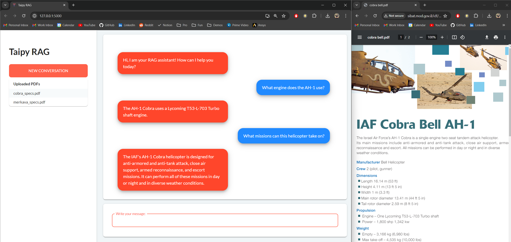
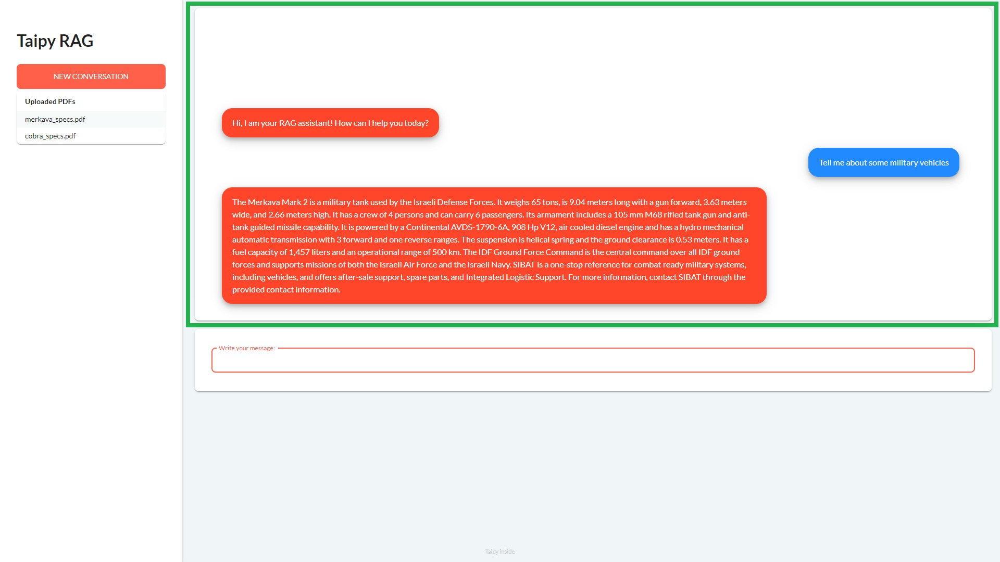

In this tutorial, we will create a Retrieval-Augmented Generation (RAG) chatbot application using Taipy. Users can
converse with the chatbot which responds with relevant and current information, through context provided via PDF files.

[Get it on GitHub](https://github.com/Avaiga/demo-gpt-4o/tree/rag){: .tp-btn .tp-btn--accent target='blank' }


{width=100% : .tp-image-border }


# Installation

This application uses some system dependencies like *tesseract* and *poppler*. To simplify development and deployment,
consider using Docker Compose:

Step 1: 

```bash
git clone -b rag --single-branch git@github.com:Avaiga/demo-gpt-4o.git
```

Step 2: 

```bash
cd demo-gpt-4o
```

Step 3: 

```bash
docker compose up
```

# Step 1: Imports

Begin by importing the packages which we'll be using for this application:

```python
from taipy.gui import Gui, notify
import taipy.gui.builder as tgb

import os
import pandas as pd
from dotenv import load_dotenv
from langchain.chains import RetrievalQA
from langchain.indexes import VectorstoreIndexCreator
from langchain.text_splitter import CharacterTextSplitter
from langchain_community.document_loaders import UnstructuredPDFLoader
from langchain_huggingface import HuggingFaceEmbeddings, HuggingFaceEndpoint
```

Our example RAG chatbot will use:

1. LangChain: A framework to simplify LLM development;
2. Hugging Face: To use the Mistral LLM; and
3. [Unstructured](https://python.langchain.com/v0.2/docs/integrations/providers/unstructured/): To read the PDFs for
   context.

# Step 2: LLM

The first step is to create a *query_llm* function which takes the user's question or instruction, and returns the
response from the LLM. The RAG-functionality used in this tutorial is **framework-agnostic** — the code is easily
adaptable for you to use your favorite models that best fit your use case. As a starting point, you may copy our example
using LangChain to serve the Mistral-7B-Instruct-v0.2 LLM from Hugging Face.

```python
load_dotenv()

PDF_FOLDER_PATH = "./pdfs"
pdf_names = os.listdir(PDF_FOLDER_PATH)
pdf_names = pd.DataFrame(pdf_names, columns=["Uploaded PDFs"])

loaders = [UnstructuredPDFLoader(os.path.join(PDF_FOLDER_PATH, fn)) for fn in os.listdir(PDF_FOLDER_PATH)]

index = VectorstoreIndexCreator(
    embedding=HuggingFaceEmbeddings(),
    text_splitter=CharacterTextSplitter(chunk_size=1000, chunk_overlap=0),
).from_loaders(loaders)

llm = HuggingFaceEndpoint(repo_id="mistralai/Mistral-7B-Instruct-v0.2", temperature=0.1, max_length=512)

chain = RetrievalQA.from_chain_type(
    llm=llm,
    chain_type="stuff",
    retriever=index.vectorstore.as_retriever(),
    input_key="question",
)

def query_llm(query_message):
    return chain.run(query_message)
```

At this point, whether you used the above example or wrote your own function, we should now have a *query_llm* function
which **takes the user query string and returns the model's response string**. Additionally, the model's context
includes the contents of the PDF files in the `pdfs/` folder.

# Step 3: Initialize GUI variables

```python
query_message = ""
messages = []
messages_dict = {}

def on_init(state):
    state.messages = [
        {
            "style": "assistant_message",
            "content": "Hi, I am your RAG assistant! How can I help you today?",
        },
    ]
    new_conv = create_conv(state)
    state.conv.update_content(state, new_conv)
```

We begin by defining the following [state variables](../../../manuals/gui/binding.md) to be used in the application:

1. `query_message`: A string bound to an input box, for the user to enter their query for the model;
2. `messages`: A list of all messages between the user and LLM;
3. `messages_dict`: A dictionary used to hold the chat partial content (see next step); and
4. `conv`: A Taipy [*partial*](../../../manuals/gui/pages/index.md/#partials) whose content is updated as new chat
   messages are added. Technically, this variable is defined in a later step, but you can see it being used in the
   *on_init* function.

If this is your first time seeing a partial in Taipy, its purpose is to dynamically generate page content. In the
following image, the panel highlighted by the green box is a partial:

{width=90% : .tp-image-border }

By using a partial, we can continually generate new chat bubbles by updating the partial's content, representing the
ongoing conversation between the user and LLM.

Furthermore, we also defined the [*on_init*](../../../manuals/gui/callbacks.md/#initialize-a-new-connection) callback
which Taipy implicitly calls when a new connection to the application is made. Now, when a user first connects to the
application, a greeting is displayed to the user in the partial "chat window".

# Step 4: Function to generate "*partial*" content

You may notice that many [callback functions](../../../manuals/gui/callbacks.md) in this application update the `conv`
partial with the statement "`state.conv.update_content(state, create_conv(state))`".

In this step, we define the *create_conv* function which generates the partial content. This is done by iterating
through `state.messages`, which contains the messages for both the user and the LLM:

```python
def create_conv(state):
    messages_dict = {}
    with tgb.Page() as conversation:
        for i, message in enumerate(state.messages):
            text = message["content"].replace("<br>", "\n").replace('"', "'")
            messages_dict[f"message_{i}"] = text
            tgb.text(
                f"{{messages_dict.get('message_{i}') or ''}}",
                class_name=f"message_base {message['style']}",
                mode="md",
            )
    state.messages_dict = messages_dict
    return conversation
```

Notice that each `tgb.text` element (representing a chat bubble) also contains 2 `class_name`s:

1. "*message_base*"; and
2. "*user_message*" or "*assistant_message*" (via `message['style']`)

These are CSS classes which we will define in a later step, which provide the look-and-feel of a chat UI.

# Step 5: Callback to query the LLM

Next up, we need a callback function to send a query to the LLM. Here, the query string entered by the user is contained
within the `state.query_message` state variable:

```python
def send_message(state):
    state.messages.append(
        {
            "style": "user_message",
            "content": state.query_message,
        }
    )
    state.conv.update_content(state, create_conv(state))
    notify(state, "info", "Sending message...")
    state.messages.append(
        {
            "style": "assistant_message",
            "content": query_llm(state.query_message),
        }
    )
    state.conv.update_content(state, create_conv(state))
    state.query_message = ""
```

This function calls the *create_conv* function **twice**: First to add the **user's message** to the chat UI, then a
second time shortly after the *query_llm* function finishes execution and returns the **LLM output**.

Again, the "*style*" key take the values of "*user_message*" or "*assistant_message*" which correspond to CSS classes
that we'll use to style each message as a chat bubble.

# Step 6: Callback to reset the chat

The final callback we need is *reset_chat*, which clears the user query string, and calls our existing *on_init*
callback function which resets the chat window to its initial state.

```python
def reset_chat(state):
    state.query_message = ""
    on_init(state)    
```

# Step 7: GUI

With all of the application logic complete, we can create an attractive GUI in Taipy with just a few lines of code:

```python
with tgb.Page() as page:
    with tgb.layout(columns="350px 1"):
        with tgb.part(class_name="sidebar"):
            tgb.text("## Taipy RAG", mode="md")
            tgb.button(
                "New Conversation",
                class_name="fullwidth plain",
                on_action=reset_chat,
            )
            tgb.table("{pdf_names}", show_all=True)

        with tgb.part(class_name="p1"):
            tgb.part(partial="{conv}", height="600px", class_name="card card_chat")
            with tgb.part("card mt1"):
                tgb.input(
                    "{query_message}",
                    on_action=send_message,
                    change_delay=-1,
                    label="Write your message:",
                    class_name="fullwidth",
                )

if __name__ == "__main__":
    gui = Gui(page)
    conv = gui.add_partial("")
    gui.run(title="Taipy RAG", dark_mode=False, margin="0px")    
```

The 3 most important components of our GUI are:

1. **Chat window**: Defined by a *part* block, bound to the `conv` partial;
2. **User input**: A text field defined by the input element, bound to `query_message`. When the user hits the action
key (Enter, by default), the *send_message* callback is triggered.
3. **Reset chat**: Defined by the button element. Calls the *reset_chat* callback when clicked.

Besides that, most of the code affects the layout and structure of the application.

# Step 8: Styling

Several Taipy blocks and elements in our application use the *class_name* property to assign it the given CSS class in
the generated HTML. Many of these classes like "*sidebar*" and "*fullwidth*" are **predefined in Taipy** — either in the
[Stylekit](../../../manuals/gui/styling/stylekit.md), or in the *Styling* section of the specific element.

However, we also used four custom classes to provide the look-and-feel of a chat UI. These are:

1. "*message_base*";
2. "*assistant_message*";
3. "*user_message*"; and
4. "*card_chat*".

These are their definitions:

```css
/* Base style for all chat messages */
.message_base {
    font-family: 'Lato';
    margin: 20px 400px 0px 20px;
    position: relative;
    display: inline-block;
    padding: 0px 20px 0px 20px;
    border-radius: 20px;
    max-width: 90%;
    box-shadow: 0 4px 8px 0 rgba(0, 0, 0, 0.2), 0 6px 20px 0 rgba(0, 0, 0, 0.19);
    color: white;
    word-wrap: break-word;
    white-space: pre-line;
}

/* Specific styles for different types of messages */
.assistant_message {
    background-color: #ff462b;
}

.user_message {
    background-color: #218aff;
    float: right;
    margin-left: 20%;
    margin-right: 30px;
}

/* Style for the chat container */
.card_chat {
    display: flex;
    flex-direction: column-reverse;
    overflow-y: auto;
}
```
