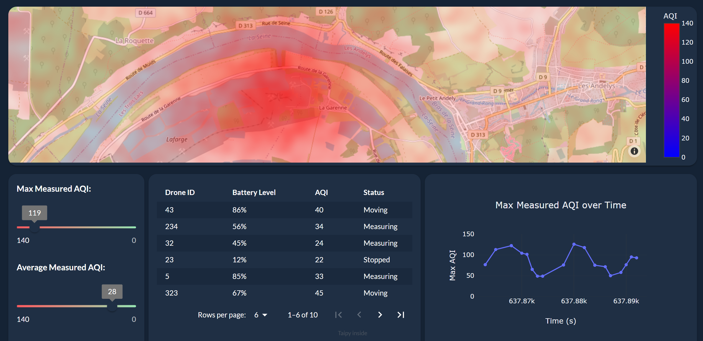
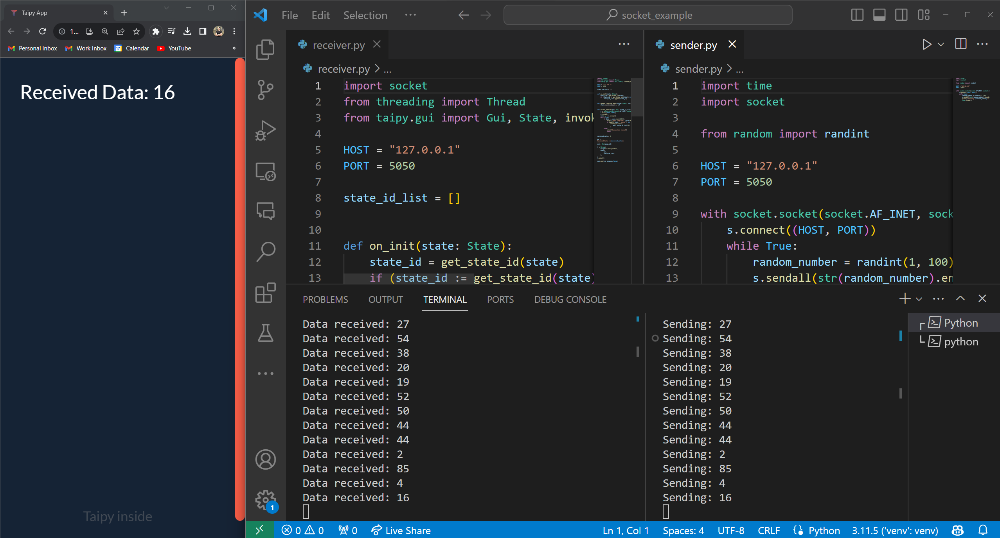

Taipy can display data that is generated in a separate thread. This is useful for displaying
real-time data from a sensor or a simulator. For example displaying in a dashboard the
information from sensors measuring air pollution around a city, or displaying CPU usage of
a server.


{width=90% : .tp-image-border }


The dashboard displayed in this image is available [here](../../../gallery/visualization/pollution_sensors/index.md)

In this article, we will code a simple example where:
- A `sender.py` script will generate a random number and send it through a socket.
- A `receiver.py` script will receive and display the number in a Taipy application.


{width=90% : .tp-image-border }


## Step 1: Create the Sender Script

Here is the code for the `sender.py` script:

```python title="sender.py"
import time
import socket

from random import randint

HOST = "127.0.0.1"
PORT = 5050

with socket.socket(socket.AF_INET, socket.SOCK_STREAM) as s:
    s.connect((HOST, PORT))
    while True:
        random_number = randint(1, 100)
        s.sendall(str(random_number).encode())
        print(f"Sending: {random_number}")
        time.sleep(5)
```

This script generates a random number between 1 and 100, sends it through a socket, and waits
5 seconds before sending another number.

## Step 2: Create the Receiver Script

Coding the receiver script requires multiple steps:

- Imports and defining the socket parameters.

```python title="receiver.py"
import socket
from threading import Thread
from taipy.gui import Gui, State, invoke_callback, get_state_id

HOST = "127.0.0.1"
PORT = 5050
```

- We gather the list of state identifiers. These are identifiers of the clients connected to
our Taipy application. We need this list to choose which client to send the data to.

```python title="receiver.py"
state_id_list = []

def on_init(state: State):
    state_id = get_state_id(state)
    if (state_id := get_state_id(state)) is not None:
        state_id_list.append(state_id)
```

- We create a function to listen to the socket. When the socket receives data, it triggers a
callback to send the data to the Taipy application for one of the connected clients.

```python title="receiver.py"
def client_handler(gui: Gui, state_id_list: list):
    s = socket.socket(socket.AF_INET, socket.SOCK_STREAM)
    s.bind((HOST, PORT))
    s.listen()
    conn, _ = s.accept()
    while True:
        if data := conn.recv(1024):
            print(f"Data received: {data.decode()}")
            if hasattr(gui, "_server") and state_id_list:
                invoke_callback(
                    gui, state_id_list[0], update_received_data, (int(data.decode()),)
                )
        else:
            print("Connection closed")
            break


def update_received_data(state: State, val):
    state.received_data = val
```

- We create the Taipy application to display the data. The *client_handler()* function and
the application itself are run in different threads.

```python title="receiver.py"
received_data = 0

md = """
Received Data: <|{received_data}|>
"""
gui = Gui(page=md)

t = Thread(
    target=client_handler,
    args=(
        gui,
        state_id_list,
    ),
)
t.start()

gui.run(title="Receiver Page")
```

## Step 3: Run the Scripts

Run the `receiver.py` script first, then the `sender.py` script in another terminal. The
receiver will receive and display the sender's data in the Taipy application.
