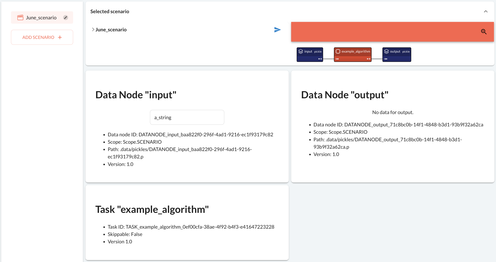
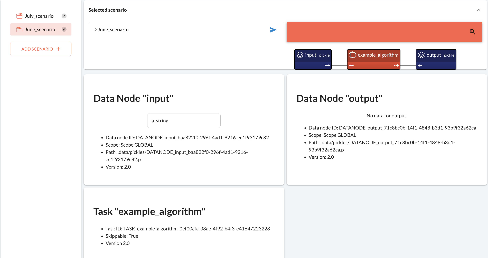

!!! warning "Available in Taipy Enterprise edition"

    This section is relevant only to the Enterprise edition of Taipy.

When running a Taipy application in *--production* mode, Taipy can access all entities
attached to the current version or another *production* version. It corresponds to the case where
the application is stable and running in a production environment.

In the following, we consider the basic Taipy application `main.py` for all our examples:
```python linenums="1" title="main.py"

```

# Convert an experiment version to production

To convert an experiment version to a production, you can run the Taipy application on the CLI with
*--production* option and providing the version name.

```console
$ taipy manage-versions --list
Version number                         Mode                   Creation date
0.1                                    Experiment (latest)    2023-01-25 12:24:19
325d0618-6f9e-459b-9597-48fa93a57a23   Experiment             2023-01-25 12:20:56
26e56e84-9e7e-4a26-93f6-443d9aa541d9   Development            2023-01-25 12:20:33

$ taipy run main.py --production 0.1
[2023-01-25 13:00:05,333][Taipy][INFO] job JOB_example_algorithm_e25214c4-1047-4136-a5db-c1241a3ddbcf is completed.
Number of scenarios: 3

$ taipy manage-versions --list
Version number                         Mode                   Creation date
0.1                                    Production (latest)    2023-01-25 13:00:05
325d0618-6f9e-459b-9597-48fa93a57a23   Experiment             2023-01-25 12:20:56
26e56e84-9e7e-4a26-93f6-443d9aa541d9   Development            2023-01-25 12:20:33
```

In the example above, Taipy converted version 0.1 to a production version before running it.

Without explicitly providing the version name, the latest version of your application is used.
Here is another example:

```console
$ taipy run main.py --experiment 1.0
[2023-01-25 13:05:17,712][Taipy][INFO] job JOB_example_algorithm_ac79138a-4c3a-4560-bbd4-f4975083bf83 is completed.
Number of scenarios: 1

$ taipy manage-versions --list
Version number                         Mode                   Creation date
1.0                                    Experiment (latest)    2023-01-25 13:05:17
0.1                                    Production             2023-01-25 13:00:05
325d0618-6f9e-459b-9597-48fa93a57a23   Experiment             2023-01-25 12:20:56
26e56e84-9e7e-4a26-93f6-443d9aa541d9   Development            2023-01-25 12:20:33

$ taipy run main.py --production
[2023-01-25 13:06:00,871][Taipy][INFO] job JOB_example_algorithm_1fcb6feb-cef1-46e0-a818-4ae2e58df57d is completed.
Number of scenarios: 5

$ taipy manage-versions --list
Version number                         Mode                   Creation date
1.0                                    Production (latest)    2023-01-25 13:06:00
0.1                                    Production             2023-01-25 13:00:05
325d0618-6f9e-459b-9597-48fa93a57a23   Experiment             2023-01-25 12:20:56
26e56e84-9e7e-4a26-93f6-443d9aa541d9   Development            2023-01-25 12:20:33
```

As you can see, we first created an experiment version named 1.0 and create one scenario.
When listing the existing versions, we see that 1.0 is the latest version.
Therefore, when running the Taipy application in production mode without providing the version name,
the latest is used and converted to production before running.

Note that once the version is converted to production, the application can access all production
entities, including older versions.

# Remove a production version

To remove a production version, you can use the `taipy manage-versions` with the *--delete-production*
option on the Taipy CLI and provide the version name (see the
[Manage versions on Taipy CLI page](../../cli/manage-versions.md) for more details).

```console
$ taipy manage-versions --delete-production 0.1
Successfully delete version 0.1 from the production version list.

$ taipy manage-versions --list
Version number                         Mode                   Creation date
1.0                                    Production (latest)    2023-01-25 13:06:00
0.1                                    Experiment             2023-01-25 13:00:05
325d0618-6f9e-459b-9597-48fa93a57a23   Experiment             2023-01-25 12:20:56
26e56e84-9e7e-4a26-93f6-443d9aa541d9   Development            2023-01-25 12:20:33
```

After running the commands above, version 0.1 is an experiment version again. It is no longer a
production version.

# Change config of an existing production version

Similar to the experiment mode, the application configuration must not have
any breaking conflict to re-run an existing production version.

Let's assume multiple changes have been made to the configuration in `main.py`.

```python linenums="1" title="main.py"

```

```console
$ taipy run main.py --production 1.0
[2023-01-25 12:52:05,484][Taipy][ERROR] The configuration for version 1.0 conflicts with the current configuration:
    DATA_NODE "my_input" has attribute "path" added: input.pkl
    DATA_NODE "my_output" has attribute "path" added: output.pkl
    DATA_NODE "my_input" has attribute "scope" modified: SCENARIO:SCOPE -> GLOBAL:SCOPE
    DATA_NODE "my_output" has attribute "scope" modified: SCENARIO:SCOPE -> GLOBAL:SCOPE
    TASK "example_algorithm" has attribute "skippable" modified: False:bool -> True:bool

Please add a new production version with migration functions.
If old entities remain compatible with the new configuration, you can also run your application with --force option to override the production configuration of version 1.0.
```

In the example above, when re-running production version 1.0, Taipy detects and displays all the
changes. As shown in the message, there are two options to deal with these changes.

First, you can run the production version with the *--force* option to force Taipy to update
the version's configuration before re-running the application.

```console
$ taipy run main.py --production 1.0 --force
[2023-07-04 10:25:41][Taipy][ERROR] The configuration for version 1.0 conflicts with the current configuration:
    DATA_NODE "my_input" has attribute "path" added: input.pkl
    DATA_NODE "my_output" has attribute "path" added: output.pkl
    DATA_NODE "my_input" has attribute "scope" modified: SCENARIO:SCOPE -> GLOBAL:SCOPE
    DATA_NODE "my_output" has attribute "scope" modified: SCENARIO:SCOPE -> GLOBAL:SCOPE
    TASK "example_algorithm" has attribute "skippable" modified: False:bool -> True:bool
[2023-07-04 10:25:41][Taipy][WARNING] Option --force is detected, overriding the configuration of version 1.0 ...
[2023-07-04 10:25:41][Taipy][INFO] Version 1.0 is already a production version.
[2023-07-04 10:25:41][Taipy][INFO] job JOB_example_algorithm_7a54227c-159d-4768-99c3-8c19c84a2e61 is completed.
```

As you can see, the application is run successfully after updating the configuration.

!!! warning

    By forcing the configuration update, you must be aware that old entities instantiated before
    the configuration change may not be compatible.

Second, to avoid overriding the configuration of that production version, you can create a new
production version and add migration functions to make entities from all production versions
compatible with each other. Let's dive deeper into this topic in the next section.

# Production version with migration functions

First, without overriding the configuration of version 1.0, let's use the
[scenario selector](../../../refmans/gui/viselements/corelements/scenario_selector.md) to create a scenario for June.



Let's closely examine the attributes of the data nodes and the task. The scopes of the data nodes are
`Scope.SCENARIO`, the skippable attribute of the task is False, and the versions of all entities are 1.0.
Keep this in mind for later comparison.

With the newly updated configuration, let's create a new production version named 2.0.

```console
$ taipy run main.py --production 2.0
[2023-07-04 11:35:31][Taipy][INFO] There is no migration function from production version "1.0" to version "2.0".
[2023-07-04 11:35:31][Taipy][INFO] job JOB_example_algorithm_e3f72ec8-86b1-40c7-a382-6f63f04e8b7b is completed.
```

Recall that Taipy can access all entities attached to any production version in the production environment.
However, since there are conflicting changes between version 1.0 and 2.0, accessing an entity from version 1.0
may lead to inconsistent behavior.

It is recommended that when there are conflicting changes between production versions, migration functions should
also be provided. These functions accept an entity as the input and should return the newly migrated entity.

From the log message, you can see that Taipy does not find any migration function from version 1.0 to 2.0.
Let's create migration functions to make entities from production version 1.0 compatible with 2.0.

```python
def migrate_datanode_scope(datanode):
    datanode.scope = Scope.GLOBAL
    return datanode

def migrate_skippable_task(task):
    task.skippable = True
    return task
```

In this example, we have 2 migration functions, `migrate_datanode_scope()` and `migrate_skippable_task()`.
Notice that between version 1.0 and 2.0, each data node has its path and scope changed. However, we only migrate
the scope because we want to keep the path pointing to the correct pickle file. You can freely modify the
migration function as you wish, but be careful with how it may affect the application.

To register the migration functions to Taipy, use the `Config.add_migration_function()^` method.
This method requires the following parameters.

- ***target_version*** represents the production version that entities are migrated to.

- ***config*** indicates the configuration or the id of the config that needs to migrate.

- ***migration_fct*** represents the migration function that takes an entity as input and returns a new entity
  compatible with the target production version.

```python
Config.add_migration_function(
    target_version="2.0",
    config="my_input",
    migration_fct=migrate_datanode_scope,
)

Config.add_migration_function(
    target_version="2.0",
    config="my_output",
    migration_fct=migrate_datanode_scope,
)

Config.add_migration_function(
    target_version="2.0",
    config="example_algorithm",
    migration_fct=migrate_skippable_task,
)
```

After registering the migration functions, we can rerun the application. Let's use the
[scenario selector](../../../refmans/gui/viselements/corelements/scenario_selector.md) to create a scenario for the month of July:


Next, let's access the scenario for the month of June:



We can see that the data node scopes are updated to `GLOBAL`, and the skippable attribute of the task is
also updated to True. Notice that since we don't migrate the path of the data nodes, the path of the data nodes
still points to the pickle files of the June scenario. And finally, all entities are now version 2.0 and compatible
with the new configuration.
